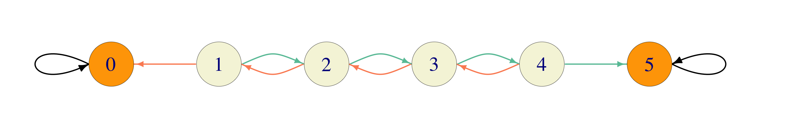
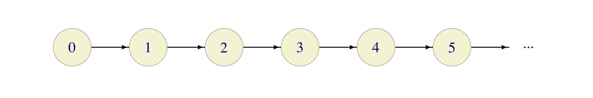

```{r child="mydefs.Rmd"}
```

# Markov Chains
<div style="counter-reset: thechapter 5;"> </div>


## The Markov property

Simply put, a stochastic process has the **Markov property** if probabilities governing its
future evolution depend only on its current position, and not on how it
got there. Here is a more precise, mathematical, definition. It will be
assumed throughout this course that any stochastic process $\seqz{X}$
takes values in a countable set $S$ called the **state space**. $S$ will always be either
finite, or countable, and a generic element of $S$ will be denoted by
$i$ or $j$.

A stochastic process $\seqz{X}$ taking values in a countable state space
$S$ is called a **Markov chain** if
\begin{equation}
 \PP[ X_{n+1}=j|X_n=i, X_{n-1}=i_{n-1},\dots, X_1=i_1, X_0=i_0]=
 \PP[ X_{n+1}=j|X_n=i],
(\#eq:markov)
\end{equation}
for all times $n\in\N_0$, all states
$i,j,i_0, i_1, \dots, i_{n-1} \in S$, whenever the two conditional
probabilities are well-defined, i.e., when
\begin{equation}
\PP[ X_n=i, \dots, X_1=i_1, X_0=i_0]>0.
(\#eq:markov-well-defined)
\end{equation}


The Markov property is typically checked in the following way: one
computes the left-hand side of \@ref(eq:markov)
and shows that its value does not
depend on $i_{n-1},i_{n-2}, \dots, i_1, i_0$ (why is that enough?). The
condition \@ref(eq:markov-well-defined)
will  be assumed (without explicit mention) every time we write a conditional
expression like to one in \@ref(eq:markov).

All chains in this course will be 
**homogeneous**, i.e., the conditional
probabilities $\PP[X_{n+1}=j|X_{n}=i]$ will not depend on the current
time $n\in\N_0$, i.e., $\PP[X_{n+1}=j|X_{n}=i]=\PP[X_{m+1}=j|X_{m}=i]$,
for $m,n\in\N_0$.


Markov chains are (relatively) easy to work with because the Markov
property allows us to compute all the probabilities, expectations,
etc. we might be interested in by using only two ingredients.

1.  The **initial distribution**: $\aaz=\sets{\az_i}{i\in S}$,
    $\az_i=\PP[X_0=i]$ - the initial probability distribution of the
    process, and

2.  **Transition probabilities**: $p_{ij}=\PP[X_{n+1}=j|X_n=i]$ - the
    mechanism that the process uses to jump around.

Indeed, if you know $\az_i$ and $p_{ij}$ for all $i,j\in S$ and want to compute
a joint distribution $\PP[X_n=i_n, X_{n-1}=i_{n-1}, \dots,
X_0=i_0]$, you can use the definition of conditional probability
and the Markov property several times (the *multiplication theorem* from
your elementary probability course) as follows:
\begin{align}
    \PP[X_n=i_n, \dots, X_0=i_0] 
       &= \PP[X_n=i_n| X_{n-1}=i_{n-1}, \dots,X_0=i_0] \cdot \PP[X_{n-1}=i_{n-1},
     \dots,X_0=i_0] \\ & 
       = \PP[X_n=i_n| X_{n-1}=i_{n-1}] \cdot \PP[X_{n-1}=i_{n-1}, \dots,X_0=i_0]\\
       &= p_{i_{n-1} i_{n}} \PP[X_{n-1}=i_{n-1}, \dots,X_0=i_0]
\end{align}
   If we repeat the same procedure $n-2$ more times (and flip the order of factors), we get
\begin{align}
\PP[X_n=i_n, \dots, X _0=i_0] &= \az_{i_0} \cdot p_{i_0 i_1} \cdot p_{i_1 i_2}\cdot  \ldots \cdot p_{i_{n-1} i_{n}}
\end{align}
Think of it this way: the probability of the process taking the trajectory $(i_0, i_1, \dots, i_n)$ is:

1. the probability of starting at $i_0$ (which is $\az_{i_0}$), 
2. multiplied by the probability of transitioning from $i_0$ to $i_1$ (which is $p_{i_0 i_1}$), 
3. multiplied by the probability of transitioning from $i_1$ to $i_2$ (which is $p_{i_1 i_2}$), 
4. etc.

When $S$ is finite, there is no loss of generality in
assuming that $S=\set{1,2,\dots, n}$, and then we usually organize the
entries of $\az$ into a *row vector* $$\aaz=(\az_1,\az_2,\dots, \az_n),$$
and the transition probabilities $p_{ij}$ into a *square matrix* $\Pr$,
where $$\Pr =\begin{bmatrix}
  p_{11} & p_{12} & \dots & p_{1n} \\
  p_{21} & p_{22} & \dots & p_{2n} \\
  \vdots  & \vdots  & \ddots & \vdots \\
  p_{n1} & p_{n2} & \dots & p_{nn} \\
\end{bmatrix}$$ In the general case ($S$ possibly infinite), one can
still use the vector and matrix notation as before, but it becomes quite
clumsy. For example, if $S=\bZ$, then $\Pr$ is an
infinite matrix $$\Pr=\begin{bmatrix}
  \ddots & \vdots & \vdots & \vdots &   \\
  \dots & p_{-1\, -1} & p_{-1\, 0} & p_{-1\, 1} & \dots \\
  \dots & p_{0\, -1} & p_{0\, 0} & p_{0\, 1} & \dots \\
  \dots & p_{1\, -1} & p_{1\, 0} & p_{1\, 1} & \dots \\
    & \vdots & \vdots & \vdots & \ddots \\
\end{bmatrix}$$

## First Examples

Here are some examples of Markov chains - you will see many more in problems and
later chapters. Markov chains with a small number of states are often depicted
as *weighted directed graphs*, whose nodes are the chain's states, and the
weight of the directed edge between $i$ and $j$ is $p_{ij}$. Such graphs are
called *transition graphs* and are an excellent way to visualize a number of
important properties of the chain. A transition graph is included for most of
the examples below. Edges are color-coded according to the probability assigned
to them. Black is always $1$, while other colors are uniquely assigned to
different probabilities (edges carrying the same probability get the same
color). 


### Random walks

Let $\seqz{X}$ be a simple (possibly biased) random walk. Let us show
that it indeed has the Markov property \@ref(eq:markov). 
Remember, first, that
$$X_n=\sum_{k=1}^n \delta_k \ewhere \delta_k \text{ are independent
(possibly biased) coin-tosses.}$$ For a choice of
$i_0, \dots, i_n, j=i_{n+1}$ (such that $i_0=0$ and
$i_{k+1}-i_{k}=\pm 1$) we have 
$$%\label{equ:}
    \nonumber 
   \begin{split}
  \PP[ X_{n+1}=i_{n+1}&|X_n=i_n, X_{n-1}=i_{n-1},\dots, X_1=i_1, X_0=i_0]\\ = &
  \PP[ X_{n+1}-X_{n}=i_{n+1}-i_{n}|X_n=i_n, X_{n-1}=i_{n-1},\dots, X_1=i_1, X_0=i_0] \\ = &
  \PP[ \delta_{n+1}=i_{n+1}-i_{n}|X_n=i_n, X_{n-1}=i_{n-1},\dots, X_1=i_1, X_0=i_0] \\= &
  \PP[ \delta_{n+1}=i_{n+1}-i_n],
   \end{split}$$ 
   
  where the last equality follows from the fact that the
increment $\delta_{n+1}$ is independent of the previous increments, and,
therefore, also of the values of $X_1,X_2, \dots, X_n$. The last line
above does not depend on $i_{n-1}, \dots, i_1, i_0$, so $X$ indeed has
the Markov property.

The state space $S$ of $\seqz{X}$ is the set $\bZ$ of all integers, and
the initial distribution $\aaz$ is very simple: we start at $0$ with
probability $1$ (so that $\az_0=1$ and $\az_i=0$, for $i\not= 0$.). The
transition probabilities are simple to write down
$$p_{ij}= \begin{cases} p, & j=i+1 \\ q, & j=i-1 \\ 0, & \text{otherwise.}
\end{cases}$$ If you insist, these can be written down in an infinite matrix,
$$\Pr=\begin{bmatrix}
  \ddots & \vdots & \vdots & \vdots & \vdots & \vdots &  \\
  \dots  & 0 & p  & 0 & 0 & 0 & \dots \\
  \dots  & q & 0  & p & 0 & 0 & \dots \\
  \dots  &0  &q   & 0  & p  & 0  & \dots \\
  \dots  &0  &0  & q& 0 & p& \dots \\
  \dots  &0  & 0 &0 & q& 0& \dots \\
  \dots  &0  & 0 &0 & 0& q& \dots \\
   & \vdots & \vdots & \vdots & \vdots & \vdots & \ddots \\
\end{bmatrix}$$ but this representation is typically not as useful as in the finite case.

Here is a (portion of) a transition graph for a simple random walk. Instead of writing probabilities 
on top of the edges, we color code them as follows: green is $p$ and orange is $1-p$. 


```{r echo=FALSE, fig.align="center"}
knitr::include_graphics('pics/random_walk_chain.png')
```


###  Gambler's ruin {#gambler}

In Gambler's ruin, a gambler starts with $\$x$, where
$0\leq x \leq a\in\N$ and in each play wins a dollar (with probability
$p\in (0,1)$) and loses a dollar (with probability $q=1-p$). When the
gambler reaches either $0$ or $a$, the game stops. For mathematical
convenience, it is usually a good idea to keep the chain defined, even
after the modeled phenomenon stops. This is usually accomplished by 
simply assuming that the process "stays alive" but remains "frozen in place"
instead of disappearing. In our case, once the gambler reaches either of
the states $0$ and $a$, he/she simply stays there forever.

Therefore, the transition probabilities are similar to those of a random
walk, but differ from them at the boundaries $0$ and $a$. The state
space is finite $S=\set{0,1,\dots, a}$ and the matrix $\Pr$ is given by
$$\Pr=\begin{bmatrix}
  1 & 0 & 0 & 0 & \dots & 0 & 0 & 0 \\
  q & 0 & p & 0 & \dots & 0 & 0 & 0 \\
  0 & q & 0 & p & \dots & 0 & 0 & 0 \\
  0 & 0 & q & 0 & \dots & 0 & 0 & 0 \\
  \vdots & \vdots & \vdots & \vdots & \ddots & \vdots & \vdots & \vdots \\
  0 & 0 & 0 & 0 & \dots & 0 & p & 0 \\
  0 & 0 & 0 & 0 & \dots & q & 0 & p \\
  0 & 0 & 0 & 0 & \dots & 0 & 0 & 1 \\
\end{bmatrix}$$ 

In the picture below, green denotes the probability $p$ and orange  $1-p$. As always, black is $1$. 

```{r echo=FALSE, fig.align="center"}

```

The initial distribution is deterministic: $$\az_i=
\begin{cases}
  1,& i=x,\\ 0,& i\not= x.
\end{cases}$$

### Regime Switching

Consider a system with two different states; think about a simple
weather forecast (rain/no rain), high/low water level in a reservoir,
high/low volatility regime in a financial market, high/low level of
economic growth, the political party in power, etc. Suppose that the
states are called $1$ and $2$ and the probabilities $p_{12}$ and
$p_{21}$ of switching states are given. The probabilities
$p_{11}=1-p_{12}$ and $p_{22}=1-p_{21}$ correspond to the system staying
in the same state. The transition matrix for this Markov chain with
$S=\set{1,2}$ is $$\Pr=
\begin{bmatrix}
  p_{11} & p_{12} \\ p_{21} & p_{22}.
\end{bmatrix}$$ When $p_{12}$ and $p_{21}$ are large (close to $1$) the
system nervously jumps between the two states. When they are small,
there are long periods of stability (staying in the same state).

```{r echo=FALSE, fig.align="center"}
knitr::include_graphics('pics/regime_switching_chain.png')
```

One of the assumptions behind regime-switching models is that the
transitions (switches) can only happen in regular intervals (once a
minute, once a day, once a year, etc.). This is a feature of all
*discrete-time* Markov chains. One would need to use a *continuous-time*
model to allow for the transitions between states at any point in time.

### Deterministically monotone Markov chain

A stochastic process $\seqz{X}$ with state space $S=\N_0$ such that
$X_n=n$ for $n\in\N_0$ (no randomness here) is called Deterministically
monotone Markov chain (DMMC). The transition matrix looks like this
$$\Pr=
\begin{bmatrix}
  0 & 1 & 0 & 0 & \dots \\
  0 & 0 & 1 & 0 & \dots \\
  0 & 0 & 0 & 1 & \dots \\
  \vdots & \vdots & \vdots & \vdots & \ddots 
\end{bmatrix}$$ 

and the transition graph like this: 

```{r echo=FALSE, fig.align="center"}

```

It is a pretty boring chain; its main use is as a counterexample.

### Not a Markov chain

Consider a frog jumping from a lily pad to a lily pad in a small forest
pond. Suppose that there are $N$ lily pads so that the state space can
be described as $S=\set{1,2,\dots, N}$. The frog starts on lily pad 1 at
time $n=0$, and jumps around in the following fashion: at time $0$ it
chooses any lily pad except for the one it is currently sitting on (with
equal probability) and then jumps to it. At time $n>0$, it chooses any
lily pad other than the one it is sitting on *and the one it visited
immediately before* (with equal probability) and jumps to it. The
position $\seqz{X}$ of the frog is not a Markov chain. Indeed, we have
$$\PP[X_3=1|X_2=2, X_1=3]= \frac{1}{N-2},$$ while
$$\PP[X_3=1|X_2=2, X_1=1]=0.$$

A more dramatic version of this example would be the one where the frog
remembers all the lily pads it had visited before, and only chooses
among the remaining ones for the next jump.

### Turning a non-Markov chain into a Markov chain

How can we turn the process the previous example into a Markov chain.
Obviously, the problem is that the frog has to remember the number of
the lily pad it came from in order to decide where to jump next. The way
out is to make this information a part of the state. In other words, we
need to change the state space. Instead of just $S=\set{1,2,\dots, N}$,
we set $S=\sets{(i_1,
  i_2)}{i_1,i_2 \in\set{1,2,\dots N}}$. In words, the state of the
process will now contain not only the number of the current lily pad
(i.e., $i_2$) but also the number of the lily pad we came from (i.e.,
$i_1$). This way, the frog will be in the state $(i_1,i_2)$ if it is
currently on the lily pad number $i_2$, and it arrived here from $i_1$.
There is a bit of freedom with the initial state, but we simply assume
that we start from $(1,1)$. Starting from the state $(i_1,i_2)$, the
frog can jump to any state of the form $(i_2, i_3)$, $i_3\not= i_1,i_2$
(with equal probabilities). Note that some states will never be visited
(like $(i,i)$ for $i\not = 1$), so we could have reduced the state space
a little bit right from the start.

It is important to stress that the passage to the new state space defines
a whole new stochastic process. It is therefore, not quite accurate, as the title suggests, 
to say that we
"turned" a non-Markov process into a Markov process. Rather, we replaced a non-Markovian
*model* of a given situation by a different, Markovian, one. 


### Deterministic functions of Markov chains do not need to be Markov chains

Let $\seqz{X}$ be a Markov chain on the state space $S$, and let
$f:S\to T$ be a function. The stochastic process $Y_n= f(X_n)$ takes
values in $T$; is it necessarily a Markov chain? 

We will see in this
example that the answer is *no*. Let $\seqz{X}$
be a simple symmetric random walk, with the usual state space $S = \bZ$. With
$r(m) = m\  (\text{mod } 3)$
denoting the remainder after the division by $3$, we first define the process $R_n = r(X_n)$ so that
$$R_n=\begin{cases} 
0, & \text{ if $X_n$ is divisible by 3,}\\
1, & \text{ if $X_n-1$ is divisible by 3,}\\
2, & \text{ if $X_n-2$ is divisible by 3.}
\end{cases}$$ 
Using $R_n$ we define $Y_n = (X_n-R_n)/3$ to be the corresponding quotient, so that $Y_n\in\bZ$ and
$$3 Y_n \leq X_n <3 (Y_n+1).$$ 
The process $Y$ is of the form $Y_n = f(X_n)$, where $f(i)= \lfloor i/3
\rfloor$, and $\lfloor x \rfloor$ is the largest integer not exceeding
$x$.

To show that $Y$ is not a Markov chain, let us consider the the event
$A=\set{Y_2=0, Y_1=0}$. The only way for this to happen is if $X_1=1$
and $X_2=2$ or $X_1=1$ and $X_2=0$, so that $A=\set{X_1=1}$. Also
$Y_3=1$ if and only if $X_3=3$. Therefore
$$\PP[ Y_3=1|Y_2=0, Y_1=0]=\PP[ X_3=3| X_1=1]= 1/4.$$ On the other hand,
$Y_2=0$ if and only if $X_2=0$ or $X_2=2$, so $\PP[Y_2=0]= 3/4$.
Finally, $Y_3=1$ and $Y_2=0$ if and only if $X_3=3$ and so
$\PP[Y_3=1, Y_2=0]= 1/8$. Hence,
$$\PP[ Y_3=1|Y_2=0]=\PP[Y_3=1, Y_2=0]/\PP[Y_2=0]= \frac{1/8}{3/4}=
\frac{1}{6}.$$ Therefore, $Y$ is not a Markov chain. If you want a more dramatic
example, try to modify this
example so that one of the probabilities above is positive, but the
other is zero.

The important property of the function $f$ we applied to $X$ is that it is *not one-to-one*. In other words, 
$f$ collapses several states of $X$ into a single state of $Y$. This way, the "present" may end up containing 
so little information that the past suddenly becomes relevant for the dynamics of the future evolution. 

### A game of tennis

In a game of tennis, the scoring system is as follows: both players start with the score of $0$. Each time
player 1 wins a point (a.k.a. *a rally*), her score moves a step up in the
following hierarchy $$0 \mapsto 15 \mapsto 30 \mapsto 40.$$ Once she
reaches $40$ and scores a point, three things can happen:

1.  if the score of player 2 is $30$ or less, player 1 wins the game.

2.  if the score of player 2 $40$, the score of player 1 moves up to "advantage",
    and

3.  if the score of player 2 is  "advantage", nothing happens to the score of player 1
     but the score of player 2 falls back to $40$.

Finally, if the score of player 1 is "advantage" and she wins a point, she
wins the game. The situation is entirely symmetric for player 2. We suppose
that the probability that player 1 wins each point is $p\in (0,1)$,
independently of the current score. A situation like this is a typical
example of a Markov chain in an applied setting. What are the states of
the process? We obviously need to know both players' scores and we also
need to know if one of the players has won the game. Therefore, a
possible state space is the following: 

\begin{align}
      S=
      \Big\{ &(0,0), (0,15), (0,30), (0,40), (15,0), (15,15), (15,30), (15,40), (30,0),
      (30,15),\\ &  (30,30),  (30,40), (40,0), (40,15), (40,30), (40,40), (40,A), (A,40), W_1, W_2 \Big\}
\end{align}

where $A$ stands for *"advantage"* and $W_1$
(resp., $W_2$) denotes the state where player 1 (resp., player 2) wins. It is not hard
to assign probabilities to transitions between states. Once we reach
either $W_1$ or $W_2$ the game stops. We can assume that the
chain remains in that state forever, i.e., the state is absorbing. 

```{r echo=FALSE, fig.align="center"}
knitr::include_graphics('pics/tennis_chain.png')
```

The
initial distribution is quite simple - we always start from the same
state $(0,0)$, so that $\az_{(0,0)}=1$ and
$\az_i=0$ for all $i\in S\setminus\set{(0,0)}$.

How about the transition matrix? When the number of states is big
($\# S=20$ in this case), transition matrices are useful in computer
memory, but not so much on paper. Just for the fun of it, here is the
transition matrix for our game-of-tennis chain (I am going to leave it up to you 
to figure out how rows/columns of the matrix match to states) $$\tiny
\Pr=
\mat{
 1 & 0 & 0 & 0 & 0 & 0 & 0 & 0 & 0 & 0 & 0 & 0 & 0 & 0 & 0 & 0 & 0 & 0 & 0 & 0 \\
 0 & 1 & 0 & 0 & 0 & 0 & 0 & 0 & 0 & 0 & 0 & 0 & 0 & 0 & 0 & 0 & 0 & 0 & 0 & 0 \\
 0 & 0 & 0 & q & 0 & 0 & p & 0 & 0 & 0 & 0 & 0 & 0 & 0 & 0 & 0 & 0 & 0 & 0 & 0 \\
 0 & 0 & 0 & 0 & q & 0 & 0 & p & 0 & 0 & 0 & 0 & 0 & 0 & 0 & 0 & 0 & 0 & 0 & 0 \\
 0 & 0 & 0 & 0 & 0 & q & 0 & 0 & p & 0 & 0 & 0 & 0 & 0 & 0 & 0 & 0 & 0 & 0 & 0 \\
 0 & q & 0 & 0 & 0 & 0 & 0 & 0 & 0 & p & 0 & 0 & 0 & 0 & 0 & 0 & 0 & 0 & 0 & 0 \\
 0 & 0 & 0 & 0 & 0 & 0 & 0 & q & 0 & 0 & p & 0 & 0 & 0 & 0 & 0 & 0 & 0 & 0 & 0 \\
 0 & 0 & 0 & 0 & 0 & 0 & 0 & 0 & q & 0 & 0 & p & 0 & 0 & 0 & 0 & 0 & 0 & 0 & 0 \\
 0 & 0 & 0 & 0 & 0 & 0 & 0 & 0 & 0 & q & 0 & 0 & p & 0 & 0 & 0 & 0 & 0 & 0 & 0 \\
 0 & q & 0 & 0 & 0 & 0 & 0 & 0 & 0 & 0 & 0 & 0 & 0 & p & 0 & 0 & 0 & 0 & 0 & 0 \\
 0 & 0 & 0 & 0 & 0 & 0 & 0 & 0 & 0 & 0 & 0 & q & 0 & 0 & p & 0 & 0 & 0 & 0 & 0 \\
 0 & 0 & 0 & 0 & 0 & 0 & 0 & 0 & 0 & 0 & 0 & 0 & q & 0 & 0 & p & 0 & 0 & 0 & 0 \\
 0 & 0 & 0 & 0 & 0 & 0 & 0 & 0 & 0 & 0 & 0 & 0 & 0 & q & 0 & 0 & p & 0 & 0 & 0 \\
 0 & q & 0 & 0 & 0 & 0 & 0 & 0 & 0 & 0 & 0 & 0 & 0 & 0 & 0 & 0 & 0 & p & 0 & 0 \\
 p & 0 & 0 & 0 & 0 & 0 & 0 & 0 & 0 & 0 & 0 & 0 & 0 & 0 & 0 & q & 0 & 0 & 0 & 0 \\
 p & 0 & 0 & 0 & 0 & 0 & 0 & 0 & 0 & 0 & 0 & 0 & 0 & 0 & 0 & 0 & q & 0 & 0 & 0 \\
 p & 0 & 0 & 0 & 0 & 0 & 0 & 0 & 0 & 0 & 0 & 0 & 0 & 0 & 0 & 0 & 0 & q & 0 & 0 \\
 0 & 0 & 0 & 0 & 0 & 0 & 0 & 0 & 0 & 0 & 0 & 0 & 0 & 0 & 0 & 0 & 0 & 0 & q & p \\
 0 & q & 0 & 0 & 0 & 0 & 0 & 0 & 0 & 0 & 0 & 0 & 0 & 0 & 0 & 0 & 0 & p & 0 & 0 \\
 p & 0 & 0 & 0 & 0 & 0 & 0 & 0 & 0 & 0 & 0 & 0 & 0 & 0 & 0 & 0 & 0 & q & 0 & 0 \\
} $$

Does the structure of a game of tennis make is easier or harder for the better
player to win? In other words, if you had to play against the best tennis player
in the world (I am rudely assuming that he or she is better than you), would you
have a better chance of winning if you only played a point (rally), or if you
played the whole game? We will give a precise answer to this question in a little while. In the
meantime, try to guess.

## Chapman-Kolmogorov equations

The transition probabilities $p_{ij}$, $i,j\in S$ tell us how a Markov
chain jumps from one state to another in a single step. Think of it as a description of
the *local* behavior of the chain. This is the information one can usually obtain from observations and modeling assumptions. On the other hand, it is the *global* (long-time) behavior of the model that
provides the most interesting insights. In that spirit, we turn our attention 
to  probabilities like this:
$$\PP[X_{k+n}=j|X_k=i] \text{ for } n = 1,2,\dots.$$
Since we are assuming that all of our
chains are homogeneous (transition probabilities do not change with
time), this probability does not depend on the time $k$, so we can define the **multi-step transition probabilities** $\pn_{ij}$ as follows:
$$\pn_{ij}=\PP[X_{k+n}=j|X_{k}=i]=\PP[ X_{n}=j|X_0=i].$$ We allow $n=0$ under
the useful convention that 
$$p^{(0)}_{ij}=\begin{cases} 1, & i=j,\\ 0,&
  i\not = j.
\end{cases}$$
We note right away that the numbers $\pn_{ij}$, $i,j\in S$ naturally fit into an $N\times N$-matrix which we denote by $\Prn$. We note right away that
\begin{equation}
  \Prz = \Id\text{ and } \Pro = \Pr,
(\#eq:Przo)
\end{equation}
where $\Id$ denotes the $N\times N$ identity matrix. 

The central result of this section is the following sequence of equalities connecting $\Prn$ for different values of $n$, know as the **Chapman-Kolmogorov equations**:
\begin{equation}
  \Prup{m+n} = \Prup{m} \Prup{n}, \text{ for all } m,n \in \N_0.
(\#eq:CK)
\end{equation}
To see why this is true we start by computing 
$\PP[ X_{n+m} = j, X_0=i]$. Since each trajectory from $i$ to $j$ in $n+m$ steps has be somewhere at time $n$, we can write
\begin{equation}
  \PP[ X_{n+m}= j, X_0 = i] = \sum_{k\in S} \PP[X_{n+m} = j, X_{n} = k, X_0 = i].
(\#eq:one-CK)
\end{equation}
 By the multiplication rule, we have
\begin{multline}
\PP[X_{n+m} = j, X_{n} = k, X_0 = i] = \PP[ X_{n+m} = j | X_{n}=k, X_{0}=i] \PP[X_{n}=k, X_0 = i],
(\#eq:two-CK)
\end{multline}
and then, by the Markov property:
\begin{equation}
  \PP[ X_{n+m} = j | X_{n}=k, X_{0}=i] = \PP[ X_{n+m} = j | X_n = k].
(\#eq:three-CK)
\end{equation}
Combining \@ref(eq:one-CK), \@ref(eq:two-CK) and \@ref(eq:three-CK) we obtain the following
equality:
\begin{equation}
  \PP[ X_{n+m}= j, X_0 = i] = \sum_{k\in S} \PP[ X_{n+m} = j | X_n = k] \PP[X_{n}=k, X_0 = i].
\end{equation}
which is nothing but \@ref(eq:CK); to see that, just remember how matrices are multiplied.

The punchline is that \@ref(eq:CK), together with \@ref(eq:Przo) imply that
\begin{equation}
  \Prn = \Pr^n,
(\#eq:Prn-Pn)
\end{equation}
where the left-hand side is the matrix composed of the $n$-step transition
probabilities, and the right hand side is the $n$-th (matrix) power of the
($1$-step) transition matrix $\Pr$. Using \@ref(eq:Prn-Pn) allows us to 
write a simple expression for the
distribution of the random variable $X_n$, for $n\in\N_0$. Remember that
the initial distribution (the distribution of $X_0$) is denoted by
$\aaz=(\az_i)_{i\in S}$. Analogously, we define the vector
$\aaa{n}=(\aa{n}_i)_{i\in S}$ by $$\aa{n}_i=\PP[X_n=i],\ i\in S.$$ Using
the law of total probability, we have
$$\aa{n}_i=\PP[X_n=i]=\sum_{k\in S} \PP[ X_0=k] \PP[ X_n=i|X_0=k]=
\sum_{k\in S} \az_k \pn_{ki}.$$ We usually interpret $\aaz$ as a (row)
vector, so the above relationship can be expressed using vector-matrix
multiplication $$\aaa{n}=\aaz \Pr^n.$$

<div class="problem">
  Find an explicit expression for $\Prn$ in the case of the regime-switching 
  chain introduced above. Feel free to assume that $p_{ij}>0$ for all $i,j$.
</div>
<div class="solution">
It is often difficult to compute $\Pr^n$ for a general transition
matrix $\Pr$ and a large $n$. We will see later that it will be easier
to find the limiting values $\lim_{n\to\infty}\pn_{ij}$. The regime-switching
chain is one of the few examples where everything can be done by hand. 

By \@ref(eq:Prn-Pn), we need to compute the $n$-th matrix power of the transition
matrix $\Pr$. To make the notation a bit nicer, let us write $a$ for $p_{12}$ and
$b$ for $p_{21}$, so that we can write
$$\Pr=
\begin{bmatrix}
  1-a & a \\ b & 1-b
\end{bmatrix}$$ 

The winning idea is to use  diagonalization, and for that we start by writing down the
characteristic equation $\det (\ld I-\Pr)=0$ of the
matrix $\Pr$:
$$\label{equ:}
    \nonumber 
   \begin{split}
 0&=\det(\ld I-\Pr)=
\begin{vmatrix}
\ld -1+a & -a \\ -b & \ld -1+b
\end{vmatrix}\\ &
=((\ld-1)+a)((\ld-1)+b)-ab
=(\ld-1)(\ld-(1-a-b)). 
   \end{split}$$ The eigenvalues are, therefore, $\ld_1=1$ and
$\ld_2=1-a-b$, and the corresponding eigenvectors are $v_1=\binom{1}{1}$ and
$v_2=\binom{a}{-b}$. Therefore, 
if we define $$V=
\begin{bmatrix}
1 & a \\ 1 & -b
\end{bmatrix} 
\eand D=
\begin{bmatrix}
  \ld_1 & 0 \\ 0 & \ld_2
\end{bmatrix}=
\begin{bmatrix}
  1 & 0 \\ 0 & (1-a-b)
\end{bmatrix}$$ we have $$\Pr V =
V D,\text{ i.e., } \Pr= V D V^{-1}.$$ This representation is very useful
for taking (matrix) powers: $$\label{equ:60C4}
 \begin{split}
    \Pr^n &= (V D V^{-1})( V D V^{-1}) \dots (V D V^{-1})= V D^n V^{-1}
  \\ & =
   V
   \begin{bmatrix}
     1  & 0 \\ 0 & (1-a-b)^n
   \end{bmatrix} V^{-1}
 \end{split}$$ We assumed that all $p_{ij}$ are positive which means, in particular, that $a+b>0$ and 
 $$V^{-1} = \tfrac{1}{a+b}
\begin{bmatrix}
  b & a \\ 1 & -1
\end{bmatrix},$$ and so 
\begin{align}
 \Pr^n &= V D^n V^{-1}= 
\begin{bmatrix}
1 & a \\ 1 & -b
\end{bmatrix}
\ 
\begin{bmatrix}
1 & 0 \\ 0 & (1-a-b)^n
\end{bmatrix}
\ 
\tfrac{1}{a+b}
\begin{bmatrix}
  b & a \\ 1 & -1
\end{bmatrix}\\
&=
 \frac{1}{a+b} 
  \begin{bmatrix}
   b & a \\ b & a 
  \end{bmatrix}
+
 \frac{(1-a-b)^n}{a+b} 
  \begin{bmatrix}
    a & -a \\ b & -b
  \end{bmatrix}\\
&=
\begin{bmatrix}
  \frac{b}{a+b}+(1-a-b)^n \frac{a}{a+b} &   \frac{a}{a+b}-(1-a-b)^n \frac{a}{a+b}\\
  \frac{b}{a+b}+(1-a-b)^n \frac{b}{a+b} &   \frac{a}{a+b}-(1-a-b)^n \frac{b}{a+b}
\end{bmatrix}
\end{align}

The expression for $\Pr^n$ above tells us a lot about the structure of
the multi-step probabilities $\pn_{ij}$ for large $n$. Note that the
second matrix on the right-hand side above comes multiplied by
$(1-a-b)^n$ which tends to $0$ as $n\to\infty$ (under our assumptions that $p_{ij}>0$.)
We can, therefore, write
$$\Pr^n\sim \frac{1}{a+b}
\begin{bmatrix}
  b & a \\ b & a
\end{bmatrix}
\text{ for large } n.$$ The fact that the rows of the right-hand side
above are equal points to the fact that, for large $n$, $\pn_{ij}$ does
not depend (much) on the initial state $i$. In other words, this Markov
chain forgets its initial condition after a long period of time. This is
a rule more than an exception, and we will study such phenomena in the
following lectures.
</div>

## How to simulate Markov chains {#mc-sim}

One of the (many) reasons Markov chains are a popular modeling tool is the ease with which they can be simulated. When we simulated a random walk, we started at $0$ and built the process by adding independent coin-toss-distributed increments. We obtained the value of the next position of the walk by *adding* the present position and the value of an independent random variable. For general Markov chain, this procedure works almost verbatim, except that the function that combines the present position 
and a value of an independent random variable may be something other than addition. 
In general, we collapse the two parts of the process - a simulation of an independent random variable and its combination with the present position - into one. Given our position, we pick the row of the transition matrix that corresponds to it and then use its elements as the probabilities that govern our position tomorrow. It will all be clear once you read through the solution of the following problem.

<div class="problem">
  Simulate $1000$ trajectories of a gambler's ruin Markov chain with $a=3$, $p=2/3$ and $x=1$ (see subsection \@ref(gambler) above for the meaning of these constants). Use the Monte Carlo method to estimate the probability that the gambler will leave the casino with $\$3$ in her pocket in at most $T=100$ time periods.
</div>
<div class="solution">
```{r tidy=F}
# state space
S = c(0, 1, 2, 3)

# transition matrix
P = matrix(c(1,   0,   0,   0,
             1/3, 0,   2/3, 0,
             0,   1/3, 0,   2/3,
             0,   0,   0,   1), 
           byrow=T, ncol=4)

T = 100 # number of time periods
nsim = 1000 # number of simulations

# simulate the next position of the chain
draw_next = function(s) {
  i = match(s, S) # the row number of the state s
  sample(S, prob = P[i, ], size = 1)
}

# simulate a single trajectory of length T
# from the initial state
single_trajectory = function(initial_state) {
  path = numeric(T)
  last = initial_state
  for (n in 1:T) {
    path[n] = draw_next(last)
    last = path[n]
  }
  return(path)
}

# simulate the entire chain
simulate_chain = function(initial_state) {
  data.frame(X0 = initial_state,
             t(replicate(
               nsim, single_trajectory(initial_state)
             )))
}

df = simulate_chain(1)
(p = mean(df$X100 == 3))

```

*R.* The function `draw_next` is at the heart of the simulation. Given the current state `s`, it looks up the row of the transition matrix `P` which corresponds to `s`. This is where the function `match` comes in handy - `match(s,S)` gives you the position of th element `s` in the vector `S`. Of course, if $S = \{ 1,2,3, \dots, n\}$ then we don't need to use `match`, as each state is "its own position". In our case, `S` is a bit different, namely $S=\{0,1,2,3\}$, and so `match(s,S)` is nothing by `s+1`. This is clearly an overkill in this case, but we still do it for didactical purposes. 

Once the row corresponding to the state `s` is identified, we use its elements as the probabilities to be fed into the command `sample`, which, in turn, returns our next state and we repeat the procedure over and over (in this case $T=100$ times). 
</div>


## Additional problems for Chapter 5


<!--
  max-roll-so-far
  ------------------------------------------------
-->
<div class="problem">
```{r child="problems/02_Basic_Chains/max-roll-so-far_prb.Rmd"}
```
</div>
<div class="solution">
```{r child="problems/02_Basic_Chains/max-roll-so-far_sol.Rmd"}
```
</div>

<!-- 
  Y-Z-Markov-chains
  ------------------------------------------------
-->
<div class="problem">
```{r child="problems/02_Basic_Chains/Y-Z-Markov-chains_prb.Rmd"}
```
</div>
<div class="solution">
```{r child="problems/02_Basic_Chains/Y-Z-Markov-chains_sol.Rmd"}
```
</div>

<!--
  number-of-consecutives
  ------------------------------------------------
-->
<div class="problem">
```{r child="problems/02_Basic_Chains/number-of-consecutives_prb.Rmd"}
```
</div>
<div class="solution">
```{r child="problems/02_Basic_Chains/number-of-consecutives_sol.Rmd"}
```
</div>


<!--
  lazy-chain
  ------------------------------------------------
-->
<div class="problem">
```{r child="problems/02_Basic_Chains/lazy-chain_prb.Rmd"}
```
</div>
<div class="solution">
```{r child="problems/02_Basic_Chains/lazy-chain_sol.Rmd"}
```
</div>

<!--
  blue-red-100
  ------------------------------------------------
-->
<div class="problem">
```{r child="problems/02_Basic_Chains/blue-red-100_prb.Rmd"}
```
</div>
<div class="solution">
```{r child="problems/02_Basic_Chains/blue-red-100_sol.Rmd"}
```
</div>


<!--
  deck-2-2
  ------------------------------------------------
-->
<div class="problem">
```{r child="problems/02_Basic_Chains/deck-2-2_prb.Rmd"}
```
</div>
<div class="solution">
```{r child="problems/02_Basic_Chains/deck-2-2_sol.Rmd"}
```
</div>

<!--
  train-m-cities
  ------------------------------------------------
-->
<div class="problemec">
```{r child="problems/02_Basic_Chains/train-m-cities_prb.Rmd"}
```
</div>
<div class="solution">
```{r child="problems/02_Basic_Chains/train-m-cities_sol.Rmd"}
```
</div>


<!-- multi-step -->

<!--
  glass-milk
  ------------------------------------------------
-->
<div class="problem">
```{r child="problems/02_Basic_Chains/glass-milk_prb.Rmd"}
```
</div>
<div class="solution">
```{r child="problems/02_Basic_Chains/glass-milk_sol.Rmd"}
```
</div>

<!--
  manual-multi-step
  ------------------------------------------------
-->
<div class="problem">
```{r child="problems/02_Basic_Chains/manual-multi-step_prb.Rmd"}
```
</div>
<div class="solution">
```{r child="problems/02_Basic_Chains/manual-multi-step_sol.Rmd"}
```
</div>


<!--
  gambler-multi-step
  ------------------------------------------------
-->
<div class="problem">
```{r child="problems/02_Basic_Chains/gambler-multi-step_prb.Rmd"}
```
</div>
<div class="solution">
```{r child="problems/02_Basic_Chains/gambler-multi-step_sol.Rmd"}
```
</div>


<!--
  car-insurance
  ------------------------------------------------
-->
<div class="problem">
```{r child="problems/02_Basic_Chains/car-insurance_prb.Rmd"}
```
</div>
<div class="solution">
```{r child="problems/02_Basic_Chains/car-insurance_sol.Rmd"}
```
</div>


<!--
  basil
  ------------------------------------------------
-->
<div id="basil"> 
<div class="problem">
```{r child="problems/02_Basic_Chains/basil_prb.Rmd"}
```
</div>
<div class="solution">
```{r child="problems/02_Basic_Chains/basil_sol.Rmd"}
```
</div>
</div>


<!--
  professor
  ------------------------------------------------
-->
<div id="professor"> 
   <div class="problem">
```{r child="problems/02_Basic_Chains/professor_prb.Rmd"}
```
</div>
<div class="solution">
```{r child="problems/02_Basic_Chains/professor_sol.Rmd"}
```
</div>
</div>


