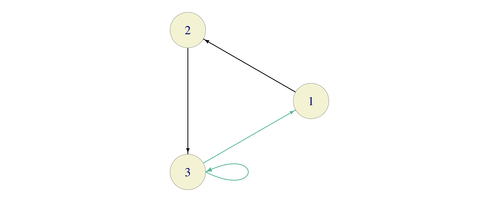

```{r child="mydefs.Rmd"}
```

# Classification of States
<div style="counter-reset: thechapter 6;"> </div>

There will be a lot of definitions and some theory before we get to
examples. You might want to peek ahead as notions are being introduced;
it will help your understanding.

## The Communication Relation

Let $\seqz{X}$ be a Markov chain on the state space $S$. For a given set
$B$ of states, define the **(first) hitting time $\tau_B$** (or $\tau(B)$ if subscripts are
impractical) **of the set $B$** as 
\begin{equation}
   \tau_B=\min\sets{n\in\N_0}{X_n\in B}.
\end{equation}
We know that $\tau_B$ is, in fact, a stopping time with
respect to $\seqz{X}$. When $B$ consists of only one element
, e.g. $B=\set{i}$, we simply write $\tau_{i}$ for $\tau_{\set{i}}$; $\tau_{i}$
is the first time the Markov chain $\seqz{X}$ "hits" the state $i$. As
always, we allow $\tau_{B}$ to take the value $\infty$; it means that
no state in $B$ is ever hit.

The hitting times are important both for applications, and for better
understanding of the structure of Markov chains in general.
For example, let $\seqz{X}$ be the chain which models a game of tennis (from the
previous lecture). The probability of winning for  Player 1 can be
phrased in terms of hitting times: $$\PP[ \text{Player 1 wins}]=\PP[ 
\tau_{i_{1}}<\tau_{i_{2}}],$$ where $i_{1}=$ "Player 1 wins" and $i_{2}=$"Player 2
wins" (the two absorbing states of the chain). We will learn how to
compute such probabilities in the subsequent lectures.


Having introduced the hitting times $\tau_B$, let us give a few more
definitions. It will be very convenient to consider the same Markov
chain with different initial distributions. Most often, these
distributions will correspond to starting from a fixed state (as opposed
to choosing the initial state at random). We use the notation $\PP_i[A]$
to mean $\PP[A|X_0=i]$ (for any event $A$), and $\EE_i[A]=\EE[A|X_0=i]$
(for any random variable $X$). In practice, we use $\PP_i$ and $\EE_i$
to signify that we are starting the chain from the state $i$, i.e.,
$\PP_i$ corresponds to a Markov chain whose transition matrix is the
same as the one of $\seqz{X}$, but the initial distribution is given by
$\PP_i[X_0=j]=0$ if $j\not = i$ and $\PP_i[X_0=i]=1$. Note also that
$\PP_i[X_1=j] = p_{ij}$ and that $\PP_i[X_n=j] =\pn_{ij}$, for any $n$.


A state $i\in S$ is said to **communicate** with the state $j\in S$,
denoted by $i\to j$ if $$\PP_i[\tau_{j}<\infty]>0.$$

Intuitively, $i$ communicates with $j$ if there is a non-zero chance
that the Markov chain $X$ will eventually visit $j$ if it starts from
$i$. Sometimes we also say that $j$ is **a consequent of** $i$, that $j$
**is accessible from** $i$, or that $j$ **follows** $i$.

In the "tennis" example of the previous chapter, 
every state is accessible from $(0,0)$ (the fact
that $p\in (0,1)$ is important here), but $(0,0)$ is not accessible from
any other state. The consequents of $(0,0)$ are not only $(15,0)$ and
$(0,15)$, but also $(30,15)$ or $(40,40)$. In fact, all states 
are consequents of $(0,0)$. The consequents of $(40,40)$ are $(40,40)$ itself, $(40,Adv)$,
$(Adv, 40)$, "P1 wins" and "P2 wins".

<div class="problem"> 
Explain why 
  $i \to j$ if and only if $\pn_{ij}>0$ for some $n\in\N_0$.
</div>
<div class="solution">
  Leaving a rigorous mathematical proof aside, we note that the statement
is intuitively easy to understand. If $i\to j$ then there must exist
some time $n$ such that $\PP_i[\tau_j = n]>0$. This, in turn, implies
that it is possible to go from $i$ to $j$ in exactly $n$ steps, where
"possible" means "with positive probability". In our notation, that is
exactly what $\pn_{ij}>0$ means.

Conversely, if $\pn_{ij}>0$ then
$\PP_i[ \tau_j <\infty] \geq \PP_i[\tau_j \leq n] \geq  \PP_i[ X_n = j]=\pn_{ij}>0.$
</div>

Two immediate properties of the relation $\to$ are listed in the problem below:

<div class="problem">
Explain why the following statements are true for all states $i,j,k$ of a Markov chain. 

1.  $i\to i$,

2.  $i\to j, j\to k$ implies $i \to k$.
</div>

<div class="solution">
  
1.  If we start from state $i\in S$ we are already there! More rigorously, note that $0$
    is allowed as a value for $\tau_{B}$ in its definition above, i.e., $\tau_i=0$ when $X_0=i$.

2.  Intuitively, if you can follow a path (sequence of arrows) from $i$ to $j$, and then another path $j$ to $k$, 
    you can do the same from $i$ to $k$ by concatenating two paths. More rigorously, by the previous problem, 
    it will be enough to show that $\pn_{ik}>0$ for some $n\in\N$. By the same
    Proposition, we know that $\pnp{n_1}_{ij}>0$ and $\pnp{n_2}_{jk}>0$
    for some $n_1,n_2\in\N_0$. By the Chapman-Kolmogorov relations, with
    $n=n_1+n_2$, we have
    \begin{equation}
      \pn_{ik} =\sum_{l\in S} \pnp{n_1}_{il} \pnp{n_2}_{lk}\geq  
      \pnp{n_1}_{ij} \pnp{n_2}_{jk}>0.
    \end{equation}
    Note that the inequality $\pn_{ik}\geq \pnp{n_1}_{il}\pnp{n_2}_{lk}$ is valid for
    all $i,l,k\in S$, as long as $n_1+n_2=n$. It will come in handy later.

</div>

Remember that the **greatest common divisor (gcd)** of a set $A$ of
natural numbers if the largest number $d\in\N$ such that $d$ divides
each $k\in A$, i.e., such that each $k\in A$ is of the form $k=l d$ for
some $l\in\N$.

A **period** $d(i)$ of a state $i\in S$ is the greatest common
divisor of the **return set** $$R(i)=\sets{n\in\N}{ \pn_{ii}>0}$$
of the state $i$. When $R(i)=\emptyset$, we set $d(i)=1$. A state
$i\in S$ is called **aperiodic** if $d(i)=1$.

<div class="problem">
  
Consider two  Markov chains with three states and the transition matrices
$$P_1=\begin{bmatrix}
 0 & 1 & 0 \\
 0 & 0 & 1 \\
 1 & 0 & 0 
\end{bmatrix}, \quad
P_2=\begin{bmatrix}
 0 & 1 & 0 \\
 0 & 0 & 1 \\
 \tfrac{1}{2} & 0 & \tfrac{1}{2} 
\end{bmatrix}$$


Find return sets and periods of each state $i$ of each chain.
</div>
<div class="solution">
For the first chain, with transition graph

```{r echo=FALSE, fig.align="center"}
knitr::include_graphics('pics/period-example-1_chain.png')
```

the return set for each state $i\in\set{1,2,3}$ is
given by $R(i)= \set{3,6,9,12,\dots}$, so $d(i)=3$ for all
$i\in\set{1,2,3}$. 

Even though the transition graph of the second chain looks very similar to the first one

```{r echo=FALSE, fig.align="center"}

```


the situation changes drastically:
\begin{align}
  R(1) & =\{ 3,4,5,6, \dots \},\\
  R(2) & =\{ 2,3,4,5,6, \dots \},\\
  R(3) & =\{ 1,2,3,4,5,6, \dots \},
\end{align}
so that $d(i)=1$ for $i\in\set{1,2,3}$.
</div>

## Classes

We say that the states $i$ and $j$ in $S$ **intercommunicate**, denoted
by $i\tofro j$ if $i\to
  j$ *and* $j\to i$. A set $B\subseteq S$ of states is called
**irreducible** if $i\tofro j$ for all $i,j\in S$.

Unlike the relation of communication, the relation of intercommunication
is symmetric. Moreover, we have the following  immediate property:
the relation $\tofro$ is an *equivalence relation* on $S$, i.e., for all
$i,j,k\in S$, we have

1.  $i\tofro i$ (*reflexivity*) ,

2.  $i\tofro j$ implies $j\tofro i$ (*symmetry*), and

3.  $i\tofro j, j\tofro k$ implies $i\tofro k$ (*transitivity*).

The fact that $\tofro$ is an equivalence relation allows us to split the
state-space $S$ into equivalence classes with respect to $\tofro$. In
other words, we can write $$S=S_1\cup S_2\cup S_3\cup \dots,$$ where
$S_1, S_2, \dots$ are mutually exclusive (disjoint) and all states in a
particular $S_n$ intercommunicate, while no two states from different
equivalence classes $S_n$ and $S_m$ do. The sets $S_1, S_2, \dots$ are
called **classes** of the chain $\seqz{X}$. Equivalently, one can say
that classes are *maximal irreducible sets*, in the sense that they are
irreducible and no class is a subset of a (strictly larger) irreducible
set. A cookbook algorithm for class identification would involve the
following steps:

1.  Start from an arbitrary state (call it $1$).

2.  Identify *all* states $j$ that intercommunicate with it ($1$,
    itself, always does).

3.  That is your first class, call it $C_1$. If there are no elements
    left, then there is only one class $C_1=S$. If there is an element
    in $S\setminus C_1$, repeat the procedure above starting from that
    element.

The notion of a class is especially useful in relation to another
natural concept: A set $B\subseteq S$ of states is said to be **closed** if $i
  \not\to j$ for all $i\in B$ and all $j\in S\setminus B$. In words, $B$ is closed if it is
  impossible to get out of. A state
$i\in S$ such that the set $\set{i}$ is closed is called **absorbing**.

<div class="problem">
Show that a set $B$ of
states is closed if and only if $p_{ij}=0$ for all $i\in B$ and all
$j\in B^c=S\setminus B$.
</div> 
<div class="solution">
 Suppose, first, that $B$ is closed. Then for $i\in B$ and $j\in
  B^c$, we have $i\not\to j$, i.e., $\pn_{ij}=0$ for all $n\in\N$. In
particular, $p_{ij}=0$.

Conversely, suppose that $p_{ij}=0$ for all $i\in B$, $j\in B^c$. We
need to show that $k\not\to l$ (i.e. $\pn_{kl}=0$ for all $n\in\N$) for
all $k\in B$, $l\in B^c$. Suppose, to the contrary, that there exist
$k\in B$ and $l\in B^c$ such that $\pn_{kl}>0$ for some $n\in
\N$. That means that we can find a sequence of states
$$k=i_0, i_1, \dots, i_n=l \text{ such that } p_{i_{m-1} i_{m}}>0
\eforall m = \ft{1}{n}.$$ The first state, $k=i_0$ is in $B$ and the
last one, $l=i_n$, is in $B^c$. Therefore there must exist an index $m$
such that $i_{m-1}\in B$ but $i_{m}\in B^c$. We also know that
$p_{i_m i_{m+1}}>0$, which is in contradiction with out assumption that
$p_{ij}=0$ for all $i\in B$ and $j\in B^c$.
</div>

Intuitively, a set of states is closed if it has the property that the
chain $\seqz{X}$ stays in it forever, once it enters it. In general, if
$B$ is closed, it does not have to follow that $S\setminus B$ is closed.
Also, a class does not have to be closed, and a closed set does not have
to be a class. Here is an example -   consider
the following three sets of states in 
the *tennis* chain of the previous lecture and:

1.  $B=\set{\text{``P1 wins''}}$: closed and a class, but
    $S\setminus B$ is not closed

2.  $B=S\setminus \set{(0,0)}$: closed, but not a class, and

3.  $B=\set{(0,0)}$: class, but not closed.

Not everything is lost as the following relationship always holds:

<div class="problem">
  Show that every closed set $B$ is a union of one or more classes.
</div>
<div class="solution">
Let $\hat{B}$ be the union of all classes $C$ such that $C\cap
  B\not=\emptyset$. In other words, take all the elements of $B$ and
throw in all the states which intercommunicate with at least one of them. I claim that
$\hat{B}=B$. Clearly, $B\subset \hat{B}$, so we need to show that
$\hat{B}\subseteq B$. Suppose, to the contrary, that there exists
$j\in \hat{B}\setminus B$. By construction, $j$ intercommunicates with
some $i\in B$. In particular $i\to j$. By the closedness of $B$, we must
have $j\in B$. This is a contradiction with the assumptions that
$j\in \hat{B}\setminus B$.

Note that the converse is not true: just take the set
$B=\set{ (0,0), (0,15)}$ in the "tennis" example. It is a union of two
classes, but it is not closed.
</div>  

  

## Transience and recurrence

It is often important to know whether a Markov chain will ever return to
its initial state, and if so, how often. The notions of transience and
recurrence are used to address this questions.

We start by introducing a cousin $T_j(1)$ of the first hitting time $\tau_1$. 
The **(first) visit time** to state $j$, denoted by $T_j(1)$ is defined
as $$T_j(1) = \min\sets{n\in\N}{X_n=j}.$$ As usual $T_j(1)=\infty$ if
$X_n\not = j$ for all $n\in\N$.
Similarly,  second, third, etc., visit times are defined as follows:
$$\begin{aligned}
  T_j(2) &= \min\sets{n>T_j(1)}{X_n=j}, \\
  T_j(3) &= \min\sets{n>T_j(2)}{X_n=j}, \text{ etc., }\end{aligned}$$
with the understanding that if $T_j(n)=\infty$, then also
$T_j(m)=\infty$ for all $m>n$.

Note that the definition of the random variable $T_j(1)$ differs from
the definition of $\tau_j$ in that the minimum here is taken over the
set $\N$ of natural numbers, while the set of non-negative integers
$\N_0$ is used for $\tau_j$. When $X_0\not = j$, the hitting time
$\tau_j$ and the first visit time $T_j(1)$ coincide. The important
difference occurs only when $X_0=j$. In that case $\tau_j=0$ (we are
already there), but it is always true that $T_j(1)\geq 1$. It can even
happen that $\PP_j[T_j(1)=\infty]=1$. If you want an example, take any state in the
deterministically monotone chain. 

A state $i\in S$ is said to be

1.  **recurrent** if $\PP_i[T_i(1)<\infty]=1$,

2.  **positive recurrent** if $\EE_i[T_i(1)]<\infty$

3.  **null recurrent** if it is recurrent, but not positive recurrent,

4.  **transient** if it is not recurrent.

A state is recurrent if we are sure we will come back to it eventually
(with probability 1). It is positive recurrent if it is recurrent and
the time between two consecutive visits has finite expectation. Null
recurrence means the we will return, but the waiting time may be very
long. A state is transient if there is a positive chance (however small)
that the chain will never return to it.

### The Return Theorem

The definition of recurrence from above is conceptually simple, but it
gives us no clue about how to actually go about deciding whether a
particular state in a specific Markov chain is recurrent. A criterion
stated entirely in terms of the transition matrix $P$ would be nice.
Before we give it, we need to introduce some notation. and prove an important theorem.
Given a state
$i$, let $f_i$ denote the probability that the chain will visit $i$
again, if it starts there, i.e., $$f_i = \PP_i[ T_i(1) < \infty].$$
Clearly, $i$ is recurrent if and only if $f_i=1$.

The interesting thing is that every time our chain visits the state $i$,
its future evolution is independent of the past (except for the name
of the current state) and it behaves exactly like a new and independent
chain started from $i$ would. This is a special case of so-called
**strong Markov property** which states that the (usual) Markov property
also holds at stopping times (and not only fixed times $n$). We will not
prove this property it these notes, but we will gladly use it to prove
the following dichotomy:

```{theorem}
(The "Return" Theorem)
Let
$\seqz{X}$ be a Markov chain on a countable state space $S$, with the
(deterministic) initial state $X_0=i$. Then exactly one of the following
two statements hold with probability 1:

1.  either the chain will return to $i$ infinitely many times, or

2.  the chain will return to $i$ a finite number $N_i$ of times, where
    $N_i$ is geometrically distributed random variable with parameter $f_i$, where
    $f_i=\PP_i[T_i(1)<\infty]$.

In the first case, $i$ is recurrent and, in the second, it is transient.
```

\medskip

**Proof.** 
If $f_i=1$, then $X$ is guaranteed to return to $i$ at least once. When
that happens, however, the strong Markov property "deletes" the past,
and the process "renews" itself. This puts us back in the original
situation where we are looking at a chain which starts at $i$ and is
guaranteed to return there at least once. Continuing like that, we get a
whole infinite sequence of stopping times $$T_i(1) < T_i(2) < \dots$$ at
which $X$ finds itself at $i$.

\medskip

If $f_i<1$, a similar story can be told, but with a significant
difference. Every time $X$ returns to $i$, there is a probability
$1-f_i$ that it will never come back to $i$, and, this is independent of
the past behavior. If we think of the return to $i$ as a success, the
number of successes before the first failure, i.e., the number of return
visits to $i$, is nothing but a geometrically distributed random
variable with parameter $f_i$. Q.E.D.  

The following interesting fact follows (almost) directly from the Return Theorem:

<div class="problem">
Suppose that the state space $S$ is finite. Show that there exists at least
one recurrent state.
</div>

<div class="solution">
We argue by contradiction and assume that all the states are transient. 
We claim that, in that case,  the total number of visits $N_i$ to each
state $i$ is always finite, no matter what state $i_0$  we start from. 
Indeed, if $i=i_0$ that is precisely the
conclusion the Return Theorem above. For a state $i\ne i_0$, the number of
visits is either $0$ - if we never even get to $i$, or $1+N_{i}$ if we
do. In either case, it is a finite number (not $\infty$).

Since $S$ is finite, it follows that the sum $\sum_{i\in S} N_i$ is also finite - a contradiction
with the fact that there are infinitely many time instances $n\in\N_0$,
and the fact that the chain must be in some state in each one of them.
</div>

If $S$ is not finite, it is not true that recurrent states must exist.
Just think of  the Deterministically-Monotone Chain or
the random walk with $p\not=\tot$. All states are transitive there.

### A recurrence criterion

Perhaps the most important consequence of the Return Theorem is the following 
criterion for recurrence of Markov chains on finite or countable state spaces:

```{theorem}
(The Recurrence Criterion)
A state $i\in S$
is recurrent if and only if $$\sum_{n\in\N} \pn_{ii}=\infty.$$
```

**Proof.**
Let $N_i$ denote the total number (finite or $\infty$) of visits to the state $i$, with the initial visit at time $0$ not counted. 
We can write $N_i$ as an infinite sum as follows
$$N_i = \sum_{n=1}^{\infty} \inds{X_n = i}.$$ 
  Taking the
expectation yields
$$\EE[N_i] = \EE_i[ \sum_{n=1}^{\infty} \inds{X_n=i}] = \sum_{n=1}^{\infty} \EE_i[ \inds{X_n=i}] = \sum_{n=1}^{\infty} \PP_i[
 X_n=i] = \sum_{n=1}^{\infty} p^{(n)}_{ii},$$ where we used the intuitively acceptable (but not rigorously proven)
fact that $\EE_i$ and an *infinite* sum can be switched.  

If $i$ is transient, i.e., if
$f_i<1$, the Return Theorem and the formula for the expected value of a geometric distribution imply that 
$$\EE_i[N_i] = \tf{f_i}{1-f_i}<\infty, \text{ and so }
 \sum_{n=1}^{\infty} p^{(n)}_{ii} = \EE_i[N_i]<\infty.$$ On the other
hand, if $i$ is recurrent, the Return Theorem states that $N_i=\infty$.  Hence,
$$\sum_{n=1}^{\infty} p^{(n)}_{ii}=\EE_i[N_i]=\infty. \text{ Q.E.D. }$$


*Remark.* The central idea behind the proof of the recurrence criterion is the following: we managed tell 
whether or not $N_i = \infty$ by checking whether $\EE[N_i]=\infty$ or not. 
This is, however, not something that can be done for any old random  variable taking values in $\N_0 \cup \set{\infty}$.
If $\EE[N]<\infty$, then, clearly $\PP[N=\infty]=0$ so that $N$ only
takes values in $\N_0$. On the other hand, it is not true that
$\PP[N=\infty]=0$ implies that $\EE[N]<\infty$. It suffices to take a
random variable with the following distribution
$$\PP[ N = n] = c/n^2 \efor n\in\N,$$ where the constant $c$ is chosen
so that $\sum_n c/n^2 =1$ (in fact, we can compute that $c=6/\pi^2$
explicitly in this case). The expected value of $N$ is given by
$$\EE[N] = \sum_{n=1}^{\infty} n \PP[N=n] = c \sum_{n=1}^{\infty} \oo{n}
  = \infty.$$ The message is that, in general, you cannot detect
whether something happened infinitely many times or not based only on
its expectation. 

Such a detection, however, becomes possible in the
special case when $N=N_i$ denotes the total number of returns to the
state $i$ of a Markov chain. This is exactly the content of proof of
the Return Theorem above: each time the chain leaves $i$, it
comes back to it (or does not) with the same probability, independently
of the past. This gives us extra information about the random variable
$N$ (namely that it is either infinite with probability $1$ or
geometrically distributed) and allows us to test its finiteness by using
the expected value only.

### Polya's theorem
Here is an application of our recurrence criterion - a beautiful and
unexpected result of George Pólya from 1921.

In addition to the simple symmetric random walk on the line ($d=1$) we
studied before, one can consider random walks whose values are in the
plane ($d=2$), the space ($d=3$), etc. These are usually defined as
follows: the random walk in $d$ dimensions is the Markov chain with the
state space $S=\bZ^d$ and the following transitions:  
starting from the state $(x_1,\dots, x_d)$, it
picks one of its $2d$ neighbors $(x_1+1,\dots, x_d)$,
$(x_1-1,\dots, x_d)$, $(x_1, x_2+1,\dots, x_d)$,
$(x_1, x_2-1,\dots, x_d)$, ..., $(x_1,\dots,
x_d+1)$, $(x_1,\dots, x_d-1)$ randomly and uniformly and moves there. For 
illustration, here is a picture of a path of a two-dimensional random walk; as time progresses, the color of the edges goes from black to orange, edges traversed
multiple times are darker, dots mark the position of the walk at time $n=0$ (the black round dot) and at time $n=1000$ (orange square dot):

<center>

```{r fig.align="center", echo=F, out.width="130%"}
library(ggplot2)
library(tibble)
T=1000
set.seed(1010)
df = data.frame(from = integer(T+1), to=integer(T+1))
df[1,] = list(0,0)
delta = matrix( c(0,1,
                  0,-1,
                  1,0,
                  -1,0), byrow=T, ncol=2)
steps = sample(1:4, size= T, replace = T)
deltas = delta[steps,]
df = data.frame( rbind(c(0,0), apply(deltas, 2, cumsum)))
colnames(df) = c("x","y")
df$c = seq.int(nrow(df))
ggplot(data=df, aes(x=x, y=y, color=c))+geom_path(alpha = 1)+
  scale_color_gradient(low="#000000", high="orange1")+
  annotate("point",0,0)+
  annotate("point",df$x[nrow(df)], df$y[nrow(df)], color="orange1", pch=15)+
  theme_bw()+
  theme(legend.position="none")+
  theme(axis.text.x=element_blank(),
          axis.text.y=element_blank(),axis.ticks=element_blank(),
          axis.title.x=element_blank(),axis.line=element_blank(),
          axis.title.y=element_blank(), panel.border=element_blank())+
  theme(
    panel.grid.minor = element_line(colour="#EEEEEE", size=0.2),
        ) +
    scale_y_continuous(minor_breaks = seq(-200,200,1), breaks = seq(-200,200,10))+
    scale_x_continuous(minor_breaks = seq(-200,200,1), breaks = seq(-200,200,10))+
  coord_fixed(xlim = c(-26,4), ylim = c(-28,1))
```
</center>

Polya's (and our) goal was to study the  recurrence properties of the
$d$-dimensional random walk. We already
know that the simple symmetric random walk on $\bZ$ is recurrent (i.e.,
every $i\in \bZ$ is a recurrent state). The easiest way to proceed when
$d\geq 2$ is to use the recurrence criterion we proved above.
We start by estimating the values $\pn_{ii}$, for
$n\in\N$. By symmetry, we can focus on the origin, i.e., it is enough to
estimate, for each $n\in\N$, the magnitude of 
$$\pn = \pn_{00}= \PP_{0}[ X_n=(0,0,\dots, 0)].$$ As we learned some time ago, 
this probability can be computed by counting all "trajectories" from $(0,\dots, 0)$ 
that return to $(0,\dots, 0)$ in $n$ steps. First of all, it is clear that $n$ needs to
be even, i.e., $n=2m$, for some $m\in\N$. It helps if we think of any
trajectory as a sequence of "increments" $\xi_1,\dots, \xi_n$, where
each $\xi_i$ takes its value in the set $\set{1,-1,2,-2,\dots, d, -d}$.
In words, $\xi_i= +k$ if the $k$-th coordinate increases by $1$ on the
$i$-th step, and $\xi_i=-k$, if the $k$-th coordinate decreases^[For $d=2$ we could have used the values "up", "down", "left" and
    "'right", for $1,-1,2$ or $-2$, respectively. In dimension $3$, we
    could have added "forward" and "backward", but we run out of words
    for directions for larger $d$.]

This way, the problem becomes combinatorial:

*In how many ways can we put one element of the set
$\set{1,-1,2,-2, \dots, d,-d}$ into each of $n=2m$ boxes so that the
number of boxes with $k$ in them equals to the number of boxes with $-k$
in them?*

To get the answer, we start by fixing a possible "count" $(i_1,\dots,
        i_d)$, satisfying $i_1+\dots+i_d=m$ of the number of times each
of the values in $\set{1,2,\dots, d}$ occurs. These values have to be
placed in $m$ of the $2m$ slots and their negatives (possibly in a
different order) in the remaining $m$ slots. So, first, we choose the
"positive" slots (in $\binom{2m}{m}$ ways), and then distribute $i_1$
"ones", $i_2$ "twos", etc., in those slots; this can be done in^[ $\binom{m}{i_1
            \dots i_d}$ is called the *multinomial coefficient*. It
    counts the number of ways we can color $m$ objects into one of $d$
    colors such that there are $i_1$ objects of color $1$, $i_2$ of
    color $2$, etc. It is a generalization of the binomial coefficient
    and its value is given by
    $$\binom{ m }{ i_1 i_2 \dots i_d} = \frac{m!}{i_1! i_2!\dots
            i_d!}.$$]
$$\binom{ m }{ i_1 i_2 \dots i_d}$$ ways. This is also the number of
ways we can distribute the negative "ones", "twos", etc., in the
remaining slots. All in all, for fixed $i_1,i_2,\dots, i_d$, all of this
can be done in $$\binom{2m}{m} \binom{ m }{ i_1 i_2 \dots i_d}^2$$ ways.
Remembering that each path has the probability $(2d)^{-2m}$, and summing
over all $i_1,\dots, i_d$ with $i_1+\dots+i_d=m$, we get
\begin{equation}
  p^{(2m)} = \frac{1}{(2d)^{2m}} \binom{2m}{m} \sum_{i_1+\dots+i_d=m}
        \binom{ m }{ i_1 i_2 \dots i_d}^2.
(\#eq:p2m)
\end{equation}
This expression looks so complicated that we better start examining is for
particular values of $d$:

1. For $d=1$, the expression above simplifies to  $p^{(2m)} = \frac{1}{4^{m}} \binom{2m}{m}$. It is
still too complicated sum over all $m\in\N$, but we can simplify it
further by using Stirling's formula
$$n! \sim \sqrt{2\pi n} \big(\tfrac{n}{e}\big)^n,$$ where $a_n \sim b_n$
means $\lim_{n\to\infty} a_n/b_n=1$. Indeed, from there,
$$\label{equ:binom}
 \begin{split}
   \binom{2m}{m} \sim \frac{4^m}{ \sqrt{\pi m}},
 \end{split} \text{ and so } p^{(2m)} \sim  \frac{1}{\sqrt{m\pi}}.$$ That means that $p^{(m)}$ behaves
 li a $p$-series with $p=1/2$ which we know is divergent. Therefore, 
 $$\sum_{m=1}^{\infty} p^{(2m)} = \infty,$$
and we recover our previous conclusion that the simple symmetric random
walk is, indeed, recurrent.

2. Moving on to the case $d= 2$, we notice that the sum of the multinomial
coefficients in \@ref(eq:p2m) no longer equals $1$; in fact it is given 
by^[Why is this identity true? Can you give a counting argument?]
$$\label{equ:Van}
 \begin{split}
   \sum_{i=0}^{m} \binom{m}{i}^2 = \binom{2m}{m},
 \end{split}$$ and, so,
$$p^{(2m)} = \frac{1}{16^m} \Big( \frac{4^m}{\sqrt{\pi m}} \Big)^2 \sim
\frac{1}{\pi m}  \text{ implying that  } \sum_{m=1}^{\infty} p^{(2m)}=\infty,$$ which
which, in turn, implies that the two-dimensional random walk is also recurrent.

3. How about $d\geq 3$? Things are even more complicated now. The
multinomial sum  in \@ref(eq:p2m) above does not admit a nice closed-form expression as in
the case $d=2$, so
we need to do some estimates; these are a bit tedious so we skip them,
but report the punchline, which is that $$p^{(2m)} 
\sim C \Big(
\tfrac{3}{m} \Big)^{3/2},$$ for some constant $C$. This is where it gets
interesting: this is a $p$-series which **converges**:
$$\sum_{m=1}^{\infty} p^{(2m)}<\infty,$$ and, so, the random walk is
transient for $d=3$. This is enough to conclude that the random walk is
transient for all $d\geq 3$, too (why?).

To summarize  

```{theorem}
(Polya)
The simple symmetric random walk is recurrent for $d=1,2$, but transient
for $d\geq 3$.
```

<br> 
In the words of Shizuo Kakutani

> *A drunk man will find his way home, but a drunk bird may get lost
> forever.*

## Class properties

Certain properties of states are shared between all elements in a class.
Knowing which properties have this feature is useful for a simple reason
- if you can check them for a single class member, you know
automatically that all the other elements of the class share it.

A property is called a **class property** it holds for all states in its
class, whenever it holds for any one particular state in the that class.

Put differently, a property is a class property if and only if either
all states in a class have it or none does.

<div class="problemec">
  Show that transience and recurrence are class properties.
</div>
<div class="solution">
We use the recurrence criterion proved above.

Suppose that the state $i$ is recurrent, and that $j$ is in its class,
i.e., that $i\tofro j$. Then, there exist natural numbers $m$ and $k$
such that $\pnp{m}_{ij}>0$ and $\pnp{k}_{ji}>0$. By the
Chapman-Kolmogorov relations, for each $n\in\N$, we have
$$\pnp{n+m+k}_{jj} =\sum_{l_1\in S} \sum_{l_2\in S} \pnp{k}_{j l_1}
\pnp{n}_{l_1 l_2} \pnp{m}_{l_2 m}\geq \pnp{k}_{ji} \pnp{n}_{ii}
\pnp{m}_{ij}.$$ In other words, there exists a positive constant $c$
(take $c=\pnp{k}_{ji}\pnp{m}_{ij}$), independent of $n$, such that
$$\pnp{n+m+k}_{jj}\geq c \pn_{ii}.$$ The recurrence of $i$ implies that
$\sum_{n=1}^{\infty}\pnp{n}_{ii}=\infty$, and so 
$$\sum_{n=1}^{\infty} \pnp{n}_{jj}\geq
\sum_{n=m+k+1}^{\infty} \pnp{n}_{jj}=
\sum_{n=1}^{\infty} \pnp{n+m+k}_{jj}\geq c \sum_{n=1}^{\infty} 
\pn_{ii}=\infty,$$ which implies that $j$ is recurrent. Thus, recurrence is a
class property, and since transience is just the opposite of recurrence,
it is clear that transience is also a class property, too.
</div>

<div class="problemec">
Show that period is a class property, i.e., all elements of a class have the same
period. 
</div> 
<div class="solution">
Let $d=d(i)$ be the period of the state $i$, and let $j\tofro i$. Then,
there exist natural numbers $m$ and $k$ such that $\pnp{m}_{ij}>0$ and
$\pnp{k}_{ji}>0$. By Chapman-Kolmogorov,
$$\pnp{m+k}_{ii}\geq \pnp{m}_{ij}\pnp{k}_{ji}>0,$$ and so $m+k\in R(i)$.
Similarly, for any $n\in R(j)$,
$$\pnp{m+k+n}_{ii}\geq \pnp{m}_{ij} \pnp{n}_{jj} \pnp{k}_{ji}>0,$$ so
$m+k+n\in R(i)$. By the definition of the period, we see now that $d(i)$
divides both $m+k$ and $m+k+n$, and, so, it divides $n$. This works for
each $n\in R(j)$, so $d(i)$ is a common divisor of all elements of
$R(j)$; this, in turn, implies that $d(i)\leq d(j)$. The same argument
with roles of $i$ and $j$ switched shows that $d(j)\leq d(i)$.
Therefore, $d(i)=d(j)$.
</div>

### The Canonical Decomposition

Now that we know that transience and recurrence are class properties, we
can introduce the notion of the of a Markov chain. Let $S_1,S_2,\dots$
be the collection of all classes; some of them contain recurrent states
and some transient ones. We learned in the previous section that if there is one
recurrent state in a class, than all states in the class must be
recurrent. Thus, it makes sense to call the whole class **recurrent**. Similarly, the
classes which are not recurrent consist entirely of transient states,
so we call them **transient**. There are at most countably many states, so the number
of all classes is also at most countable. In particular, there are only
countably (or finitely) many recurrent classes, and we usually denote
them by $C_1, C_2, \dots$. Transient classes are denoted by
$T_1,T_2, \dots$. There is no special rule for the choice of indices
$1,2,3,\dots$ for particular classes. The only point is that they can be
enumerated because there are at most countably many of them.

The distinction between different transient classes is usually not very
important, so we pack all transient states together in a set
$T=T_1\cup T_2\cup \dots$.

**Definition.**
Let $S$ be the state space of a Markov chain $\seqz{X}$. Let
$C_1,C_2, \dots$ be its recurrent classes,  $T_1,T_2,\dots$ the
transient classes, and let $T=T_1\cup T_2\cup \dots$ be their union. The
decomposition $$S= T \cup C_1 \cup C_2 \cup C_3 \cup \dots,$$ is called
the **canonical decomposition** of the (state space of the) Markov chain $\seqz{X}$.  


The reason that recurrent classes are important is simple - they can be
interpreted as Markov chains themselves. To see why, we start with the following
problem:
<div class="problem">
  Show that recurrent classes are necessarily closed.
</div>
<div class="solution">
We argue by contradiction and assume that that $C$ is a recurrent class 
which is not closed. Then, there
exist states $i\in C$ and $j\in C^c$ such that $i\to j$. On the other
hand, since $j\not\in C$ and $C$ is a class, we cannot have $j\to i$.
Started at $i$, the chain will reach $j$ with positive probability, and,
since $j\not\to i$, never return. That implies that the number of visits
to $i$ will be finite, with positive probability. That is in
contradiction with the fact that $i$ is recurrent and the statement of
the Return Theorem above.
</div>

The fact we just proved implies the following nice dichotomy, valid for
every finite-state-space chain:

<div class="problem">
A class of a Markov chain on a *finite* state space is recurrent if and
only if it is closed.
</div>
<div class="solution">
We know that recurrent classes are closed. In order to show the
converse, we need to prove that transient classes are not closed.
Suppose, to the contrary, the there exists a finite state-space Markov
chain with a closed transient class $T$. Since $T$ is closed, we can see
it as a state space of the restricted Markov chain. This, new, Markov
chain has a finite number of states so there exists a recurrent state.
This is a contradiction with the assumption that $T$ consists only of
transient states.
</div>

The condition of finiteness is necessary for the above equivalent to hold. For a random walk on $\mathbb Z$, all states
intercommunicate. In particular, there is only one class - $\mathbb Z$
itself -  and it it trivially closed. If $p\not=\tot$, however, all states
are transient, and, so, $\mathbb Z$ is a closed and transient class.

Together with the canonical decomposition, we introduce the of the
transition matrix $P$. The idea is to order the states in $S$ with the
canonical decomposition in mind. We start from all the states in $C_1$,
followed by all the states in $C_2$, etc. Finally, we include all the
states in $T$. The resulting matrix looks like this $$P=
\begin{bmatrix}
P_1 & 0   & 0   & \dots & 0 \\
0   & P_2 & 0   & \dots & 0 \\
0   & 0   & P_3 & \dots & 0 \\
\vdots & \vdots & \vdots & \ddots & \vdots \\
Q_1 & Q_2 & Q_3 & \dots & \dots
\end{bmatrix},$$ where the entries should be interpreted as matrices:
$P_1$ is the transition matrix within the first class, i.e.,
$P_1=(p_{ij},i\in C_1,
j\in C_1)$, etc. $Q_k$ contains the transition probabilities from the
transient states to the states in the (recurrent) class $C_k$. We learned, above, that recurrent classes are closed, which implies implies that each $P_k$ is a stochastic
matrix, or, equivalently, that all the entries in the row of $P_k$
outside of $P_k$ are zeros.


## A few examples

To help you internalize the notions introduced in this chapter, we classify the states, identify closed sets and discuss periodicity, transience and recurrence in some of the standard examples.
In all examples below we assume that $0 < p < 1$.

### Random walks

-   **Communication and classes**. Clearly, it is possible to go from
    any state $i$ to either $i+1$ or $i-1$ in one step, so $i\to i+1$
    and $i\to i-1$ for all $i\in S$. By transitivity of communication,
    we have $i\to i+1\to i+2\to \dots\to i+k$. Similarly, $i\to i-k$ for
    any $k\in\N$. Therefore, $i\to j$ for all $i,j\in S$, and so,
    $i\tofro j$ for all $i,j\in S$, and the whole $S$ is one big class.

-   **Closed sets**. The only closed set is $S$ itself.

-   **Transience and recurrence** We studied transience and recurrence
    in the lectures about random walks (we just did not call them that).
    The situation highly depends on the probability $p$ of making an
    up-step. If $p>\tot$, there is a positive probability that the first
    step will be "up", so that $X_1=1$. Then, we know that there is a
    positive probability that the walk will never hit $0$ again.
    Therefore, there is a positive probability of never returning to
    $0$, which means that the state $0$ is transient. A similar argument
    can be made for any state $i$ and any probability $p\not=\tot$. What
    happens when $p=\tot$? In order to come back to $0$, the walk needs
    to return there from its position at time $n=1$. If it went up, the
    we have to wait for the walk to hit $0$ starting from $1$. We have
    shown that this *will* happen sooner or later, but that the expected
    time it takes is infinite. The same argument works if $X_1=-1$. All
    in all, $0$ (and all other states) are null-recurrent (recurrent,
    but not positive recurrent).

-   **Periodicity**. Starting from any state $i\in S$, we can return to
    it after $2,4,6,\dots$ steps. Therefore, the return set $R(i)$ is
    always given by $R(i)=\set{2,4,6,\dots}$ and so $d(i)=2$ for all
    $i\in S$.

### Gambler's ruin

-   **Communication and classes**. The winning state $a$ and the losing
    state $0$ are clearly absorbing, and form one-element classes. The
    other $a-1$ states intercommunicate among each other, so they form a
    class of their own. This class is not closed (you can - and will -
    exit it and get absorbed sooner or later).

-   **Transience and recurrence**. The absorbing states $0$ and $a$ are
    (trivially) positive recurrent. All the other states are transient:
    starting from any state $i\in\set{1,2,\dots, a-1}$, there is a
    positive probability (equal to $p^{a-i}$) of winning every one of
    the next $a-i$ games and, thus, getting absorbed in $a$ before
    returning to $i$.

-   **Periodicity**. The absorbing states have period $1$ since
    $R(0)=R(a)=\N$. The other states have period $2$ (just like in the
    case of a random walk).

### Deterministically monotone Markov chain

-   **Communication and classes**. A state $i$ communicates with the
    state $j$ if and only if $j\geq i$. Therefore $i\tofro j$ if and
    only if $i=j$, and so, each $i\in S$ is in a class by itself.

-   **Closed sets**. The closed sets are precisely the sets of the form
    $B={i,i+1,i+2,\dots}$, for $i\in\N$.

-   **Transience and recurrence** All states are transient.

-   **Periodicity**. The return set $R(i)$ is empty for each $i\in S$,
    so $d(i)=1$, for all $i\in S$.

### The game of tennis

-   **Communication and classes**. All the states except for those in
    $E=\{ (40,Adv), (40,40), (Adv,40),$
    $\text{P1 wins}, \,\text{P2 wins}\}$ intercommunicate only
    with themselves, so each $i\in S\setminus E$ is in a class by
    itself. The winning states *P1 wins* and *P2 wins* are
    absorbing, and, so, also form classes with one element. Finally, the
    three states in $\{(40,Adv),(40,40),(Adv,40)\}$ intercommunicate
    with each other, so they form the last class.

-   **Periodicity**. The states $i$ in $S\setminus E$ have the
    property that $\pn_{ii}=0$ for all $n\in\N$, so $d(i)=1$. The
    winning states are absorbing so $d(i)=1$ for
    $i\in \{\text{P1 wins, P2
        wins}\}$. Finally, the return set for the remaining three states
    is $\{2,4,6,\dots\}$ so their period is $2$.


## Additional problems for Chapter 6


<!--
  cl-stat-09
  ------------------------------------------------
-->
<div class="problem">
```{r child="problems/03_Classification_of_States/cl-stat-09_prb.Rmd"}
```
</div>
<div class="solution">
```{r child="problems/03_Classification_of_States/cl-stat-09_sol.Rmd"}
```
</div>


<!--
  cl-stat-02
  ------------------------------------------------
-->
<div class="problem">
```{r child="problems/03_Classification_of_States/cl-stat-02_prb.Rmd"}
```
</div>
<div class="solution">
```{r child="problems/03_Classification_of_States/cl-stat-02_sol.Rmd"}
```
</div>


<!--
  cl-stat-04
  ------------------------------------------------
-->
<div class="problem">
```{r child="problems/03_Classification_of_States/cl-stat-04_prb.Rmd"}
```
</div>
<div class="solution">
```{r child="problems/03_Classification_of_States/cl-stat-04_sol.Rmd"}
```
</div>


<!--
  cl-stat-06
  ------------------------------------------------
-->
<div class="problem">
```{r child="problems/03_Classification_of_States/cl-stat-06_prb.Rmd"}
```
</div>
<div class="solution">
```{r child="problems/03_Classification_of_States/cl-stat-06_sol.Rmd"}
```
</div>


<!--
  cl-stat-07
  ------------------------------------------------
-->
<div class="problem">
```{r child="problems/03_Classification_of_States/cl-stat-07_prb.Rmd"}
```
</div>
<div class="solution">
```{r child="problems/03_Classification_of_States/cl-stat-07_sol.Rmd"}
```
</div>


<!--
  cl-stat-08
  ------------------------------------------------
-->
<div class="problem">
```{r child="problems/03_Classification_of_States/cl-stat-08_prb.Rmd"}
```
</div>
<div class="solution">
```{r child="problems/03_Classification_of_States/cl-stat-08_sol.Rmd"}
```
</div>


<!--
  cl-stat-10
  ------------------------------------------------
-->
<div class="problem">
```{r child="problems/03_Classification_of_States/cl-stat-10_prb.Rmd"}
```
</div>
<div class="solution">
```{r child="problems/03_Classification_of_States/cl-stat-10_sol.Rmd"}
```
</div>


 <!--
  cl-stat-11
  ------------------------------------------------
-->
<div class="problem">
```{r child="problems/03_Classification_of_States/cl-stat-11_prb.Rmd"}
```
</div>
<div class="solution">
```{r child="problems/03_Classification_of_States/cl-stat-11_sol.Rmd"}
```
</div>


<!--
  cl-stat-12
  ------------------------------------------------
-->
<div class="problem">
```{r child="problems/03_Classification_of_States/cl-stat-12_prb.Rmd"}
```
</div>
<div class="solution">
```{r child="problems/03_Classification_of_States/cl-stat-12_sol.Rmd"}
```
</div>

<!--
  cl-stat-13
  ------------------------------------------------
-->
<div class="problem">
```{r child="problems/03_Classification_of_States/cl-stat-13_prb.Rmd"}
```
</div>
<div class="solution">
```{r child="problems/03_Classification_of_States/cl-stat-13_sol.Rmd"}
```
</div>


<!--
  cl-stat-14
  ------------------------------------------------
-->
<div class="problem">
```{r child="problems/03_Classification_of_States/cl-stat-14_prb.Rmd"}
```
</div>
<div class="solution">
```{r child="problems/03_Classification_of_States/cl-stat-14_sol.Rmd"}
```
</div>

<!--
  four-stmts
  ------------------------------------------------
-->
<div class="problem">
```{r child="problems/03_Classification_of_States/four-stmts_prb.Rmd"}
```
</div>
<div class="solution">
```{r child="problems/03_Classification_of_States/four-stmts_sol.Rmd"}
```
</div>


⬇︎ In case you were wondering, the text below belongs to footnotes from somewhere high above.⬇︎


