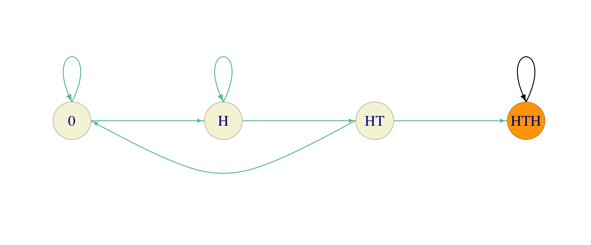

```{r child="mydefs.Rmd"}
```

# Absorption and Reward
<div style="counter-reset: thechapter 7;"> </div>

**Caveat:** From now on, all Markov chains will have **finite** state spaces.


## Absorption

Remember the "Tennis" example from a few lectures ago and the question
we asked there, namely, how does the probability of winning a single
point affect the probability of winning the overall game? An algorithm
that will help you answer that question will be described in this
lecture.

The first step is to understand the structure of the question asked in
the light of the canonical decomposition of the previous lecture. In the
"Tennis" example, all the states except for the winning ones are
transient, and there are two one-element recurrent classes {"Player 1 wins"}
and {"Player 2 wins"} The chain starts from a transient
state $(0,0)$, moves around a bit, and, eventually, gets absorbed in one
of the two. The probability we are interested in is not the probability
that the chain will eventually get absorbed. That probability is always
$1$. We are, instead, interested in the probability that the absorption
will occur in a particular state - the state "Player 1 wins" (as
opposed to "Player 2 wins") in the "Tennis" example.

A more general version of the problem above is the following: let
$i\in S$ be any state, and let $j$ be a recurrent state. If the set of
all recurrent states is denoted by $C$, and if $\tau_{C}$ is the first
hitting time of the set $C$, then $X_{\tau_{C}}$ denotes the first
recurrent state visited by the chain. Equivalently, $X_{\tau_{C}}$ is
the value of $X$ at (random) time $\tau_{C}$; its value is the name of
the state in which it happens to find itself the first time it hits the
set of all recurrent states. For any two states $i,j\in S$, the $u_{ij}$
is defined as
$$u_{ij}=\PP_i[ X_{\tau_C}=j]=\PP_i[\text{ the first recurrent state visited by $X$ is $j$ }].$$ There are several boring situations to
discard first:

1.  *$j$ is transient:* in this case $u_{ij}=0$ for any $i$ because $j$
    cannot possibly be the first recurrent state we hit - it is not even
    recurrent.

2.  *$j$ is recurrent, and so is $i$*. Since $i$ is recurrent, i.e.,
    $i\in C$, we clearly have $\tau_C=0$. Therefore $u_{ij} = \PP_i[
        X_0= j]$, and this equals to either $1$ or $0$, depending on
    whether $i=j$ or $i\ne j$.

That leaves us with the situation where $i \in T$ and $j\in C$ as the
interesting one. In many calculations related to Markov chains, the
method of *first-step decomposition* works miracles. Simply, we cut the
probability space according to what happened in the first step and use
the law of total probability (assuming $i\in T$, $j\in C$)
$$\label{equ:system-for-u}
   \nonumber 
   \begin{split}
u_{ij} & =\PP_i[ X_{\tau_C}=j]=\sum_{k\in S} 
\PP[X_{\tau_C}=j|X_0=i, X_1=k] \PP[ X_1=k|X_0=i]\\
&=
\sum_{k\in S} 
\PP[X_{\tau_C}=j|X_1=k]p_{ik}
   \end{split}$$ The conditional probability $\PP[X_{\tau_C}=j|X_1=k]$
is an absorption probability, too. If $k=j$, then
$\PP[X_{\tau_C}=j|X_1=k]=1$. If $k\in C\setminus\set{j}$, then we are
already in C, but in a state different from $j$, so $\PP[
X_{\tau_C}=j|X_1=k]=0$. Therefore, the sum above can be written as
$$\label{equ:syst}
 \begin{split}
   u_{ij}= \sum_{k\in T} p_{ik} u_{kj} + p_{ij},
 \end{split}$$ which is a system of linear equations for the family
$( u_{ij}, i\in T,
j\in C)$. Linear systems are typically better understood when
represented in the matrix form. Let $U$ be a $T\times C$-matrix
$U=(u_{ij}, i\in T, j\in C)$, and let $Q$ be the portion of the
transition matrix $P$ corresponding to the transitions from $T$ to $T$,
i.e. $Q=(p_{ij},i\in T, j\in T)$, and let $R$ contain all transitions
from $T$ to $C$, i.e., $R=(p_{ij})_{i\in T, j\in C}$. If $P_C$ denotes
the matrix of all transitions from $C$ to $C$, i.e.,
$P_C=(p_{ij}, i\in C, j\in C)$, then the canonical form of $P$ looks
like this: $$P=
\begin{bmatrix}
P_C & 0 \\ R & Q 
\end{bmatrix}.$$ The system
now becomes: $$U= QU+R,\text{ i.e., } (I-Q) U = R.$$ If the matrix $I-Q$
happens to be invertible, we are in business, because we then have an
explicit expression for $U$: $$U= (I-Q)^{-1} R.$$ So, is $I-Q$
invertible? It is when the state space $S$ is finite; here is the
argument, in case you are interested:

**Theorem.** When the state space $S$ is finite, the
matrix $I-Q$ is invertible and $$
 \begin{split}
   (I-Q)^{-1} = \sum_{n=0}^{\infty} Q^n.
 \end{split}$$ Moreover, the entry at the position $i,j$ in $(I-Q)^{-1}$
is the expected total number of visits to the state $j$, for a chain
started at $i$.


**Proof.** For $k\in\N$, the matrix $Q^k$ is the same as the submatrix
corresponding to the transient states of the full $k$-step transition
matrix $P^k$. Indeed, going from a transient state to another transient
state in $k$ steps can only happen via other transient states (once we
hit a recurrent class, we are stuck there forever).

Using the same idea as in the proof of our recurrence criterion in the previous chapter
we can conclude that for any two transient states $i$ and $j$,
we have (remember $\EE_i[
  \inds{X_n = j}] = \PP_i[X_n = j] = p_{ij}^{(n)}$)
$$\EE_i[ \sum_{n=0}^{\infty} \inds{X_n = j}] = \sum_{n\in\Nz} p^{(n)}_{ij} =
  \sum_{n\in\Nz} q^{(n)}_{ij} = (\sum_{n\in\N_0} Q^n)_{ij}.$$ On the
other hand, the left hand side above is simply the expected number of
visits to the state $j$, if we start from $i$. Since both $i$ and $j$
are transient, this number will either be $0$ (if the chain never even
reaches $j$ from $i$), or a geometric random variable (if it does). In
either case, the expected value of this quantity is finite, and, so
$$\sum_{n\in\N_0} q^{(n)}_{ij}<\infty.$$ Therefore, the matrix sum
$F = \sum_{n\in\N_0} Q^n$ is well defined, and it remains to make sure
that $F = (I-Q)^{-1}$, which follows from the following simple
computation:
$$QF = Q \sum_{n\in\N_0} Q^n = \sum_{n\in\N_0} Q^{n+1} = \sum_{n\in\N} Q^n = 
  \sum_{n\in\N_0} Q^n - I = F - I. \text{ Q.E.D.}$$

\medskip

When the inverse $(I-Q)^{-1}$ exists (like in the finite case), it is
called the **fundamental matrix** of the Markov chain. 

Before we turn to the "Tennis" example, let us analyze a simpler case of
Gambler's ruin with $a=3$.

<div class="problem">
What is the probability that a gambler coming in at $x=\$1$ in a Gambler's ruin problem with $a=3$ succeeds in "getting rich"? We *do not* assume that $p=\tot$.
</div>
<div class="solution">
  The states $0$ and $3$ are absorbing, and all
the others are transient. Therefore $C_1=\set{0}$, $C_2=\set{3}$ and
$T=T_1=\set{1,2}$. The transition matrix $P$ in the canonical form (the
rows and columns represent the states in the order $0,3,1,2$) $$P=
\begin{bmatrix}
1 & 0 & 0 & 0\\
0 & 1 & 0 & 0\\
1-p & 0 & 0 & p\\
0 & p & 1-p & 0
\end{bmatrix}$$ Therefore, $$R=
\begin{bmatrix}
1-p & 0 \\ 0 & p
\end{bmatrix}
\text{ and }
Q=
\begin{bmatrix}
0 & p \\ 1-p & 0
\end{bmatrix}.$$ The matrix $I-Q$ is a $2\times 2$ matrix so it is easy
to invert: $$(I-Q)^{-1}= \frac{1}{1-p+p^2}\begin{bmatrix}
1 & p \\ 1-p & 1
\end{bmatrix}.$$ So $$U= \frac{1}{1-p+p^2}\begin{bmatrix}
1 & p \\ 1-p & 1
\end{bmatrix}
\begin{bmatrix}
1-p & 0 \\ 0 & p
\end{bmatrix}
=
\begin{bmatrix}
\frac{1-p}{1-p+p^2} & \frac{p^2}{1-p+p^2} \\
\frac{(1-p)^2}{1-p+p^2} & \frac{p}{1-p+p^2} \\
\end{bmatrix}.$$ Therefore, for  the initial "wealth" is 1,
the probability of getting rich before bankruptcy is $u_{13}=p^2/(1-p+p^2)$ (the entry in the first row ($x=1$) and the second column ($a=3$) of $U$.)
</div>

<div class="problem">
Find the probability of winning a whole game of Tennis, for a player whose 
probability of winning a single rally is $p=0.45$. 
</div>
<div class="solution">
In the "Tennis" example, the transition matrix is $20\times 20$, with only 2
recurrent states (each in its own class). In order to find the matrix $U$, we (essentially) need to invert an $18\times 18$ matrix and that is a 
job for a computer. We start with an R function which produces the transition
matrix $P$ as a function of the single-rally probability $p$. Even though we only care about $p=0.45$ here, the extra flexibility will come in handy soon:

```{r tidy=FALSE}
S= c("0-0", "0-15", "15-0", "0-30", "15-15", "30-0", "0-40", "15-30", 
     "30-15", "40-0", "15-40", "30-30", "40-15", "40-30", "30-40", 
     "40-40", "40-A", "A-40", "P1", "P2")

tennis_P = function(p) {
  matrix(c( 
    0,1-p,p,0,0,0,0,0,0,0,0,0,0,0,0,0,0,0,0,0,
    0,0,0,1-p,p,0,0,0,0,0,0,0,0,0,0,0,0,0,0,0,
    0,0,0,0,1-p,p,0,0,0,0,0,0,0,0,0,0,0,0,0,0,
    0,0,0,0,0,0,1-p,p,0,0,0,0,0,0,0,0,0,0,0,0,
    0,0,0,0,0,0,0,1-p,p,0,0,0,0,0,0,0,0,0,0,0,
    0,0,0,0,0,0,0,0,1-p,p,0,0,0,0,0,0,0,0,0,0,
    0,0,0,0,0,0,0,0,0,0,p,0,0,0,0,0,0,0,0,1-p,
    0,0,0,0,0,0,0,0,0,0,1-p,p,0,0,0,0,0,0,0,0,
    0,0,0,0,0,0,0,0,0,0,0,1-p,p,0,0,0,0,0,0,0,
    0,0,0,0,0,0,0,0,0,0,0,0,1-p,0,0,0,0,0,p,0,
    0,0,0,0,0,0,0,0,0,0,0,0,0,0,p,0,0,0,0,1-p,
    0,0,0,0,0,0,0,0,0,0,0,0,0,p,1-p,0,0,0,0,0,
    0,0,0,0,0,0,0,0,0,0,0,0,0,1-p,0,0,0,0,p,0,
    0,0,0,0,0,0,0,0,0,0,0,0,0,0,0,1-p,0,0,p,0,
    0,0,0,0,0,0,0,0,0,0,0,0,0,0,0,p,0,0,0,1-p,
    0,0,0,0,0,0,0,0,0,0,0,0,0,0,0,0,1-p,p,0,0,
    0,0,0,0,0,0,0,0,0,0,0,0,0,0,0,p,0,0,0,1-p,
    0,0,0,0,0,0,0,0,0,0,0,0,0,0,0,1-p,0,0,p,0,
    0,0,0,0,0,0,0,0,0,0,0,0,0,0,0,0,0,0,1,0,
    0,0,0,0,0,0,0,0,0,0,0,0,0,0,0,0,0,0,0,1),
 byrow=T, ncol = 20 )
}
```

The positions of the initial state "0-0" in the state-space vector 
`S` is $1$, and the 
positions of the two absorbing states "P1" and "P2" are $19$ and $20$.
Therefore the matrices  $Q$ and  $R$ are obtained by vector indexing as follows:

```{r}
P=tennis_P(0.45)
Q = P[1:18, 1:18]
R = P[1:18, 19:20]
```

Linear systems are solved by using the command `solve` in R:

```{r}
I = diag(18) # the identity matrix the same size as Q
U = solve(I - Q, R)
U[1,]
```

Therefore, the probability that Player 1 wins the entire rally is about $0.377$. Note
that this number is smaller than $0.45$, so it appears that the game is 
designed to make it easier for the better player to win. For more evidence, 
let's draw the graph of this probability for several values of $p$ 
(`sapply` is the version of `apply` for vectors):

```{r echo=c(1,2,3)}
prob_win = function(p) {
  if (p %in% c(0,1))
    return(p)
  P = tennis_P(p)
  Q = P[1:18, 1:18]
  R = P[1:18, 19:20]
  U = solve(diag(18) - Q, R)
  U[1,1]
}
ps = seq(0, 1, by=0.01)
prob_game = sapply(ps,prob_win)
```

A graph of `p` vs. `prob_game`, where the dashed line is the line $y=x$ looks like this:

```{r echo=FALSE}
d = data.frame(p=ps, prob_game)
ggplot(data=d, aes(x=p, y=prob_game))+
  geom_line(size=1, color="red")+
  annotate("segment", x=0,y=0,xend=1,yend=1, linetype="dashed")+
  ylab("Probability of winning a game")+
  coord_fixed()
```

Using a symbolic
software package (like *Mathematica*) we can even get an explicit
expression for the win probability in this case:
\begin{align}
u_{(0,0)\ \   "P1\ wins"} = p^4 + 4 p^4 q + 10 p^4 q^2 + \frac{20 p^5 q^3}{1-2pq}.
\end{align}
Actually, you don't really need computers to derive the
expression above. Can you do it by finding all the ways in which the
game can be won in $n=4,5,6,8, 10, 12,  \dots$ rallies, computing their
probabilities, and then adding them all up?
</div>

## Expected reward

Suppose that each time you visit a transient state $j\in T$ you receive
a *reward* $g(j)\in\R$. The name "reward" is a bit misleading since the
negative $g(j)$ corresponds more to a fine than to a reward; it is just
a name, anyway. Can we compute the expected total reward before
absorption $$v_i=\EE_i[ \sum_{n=0}^{\tau_{C}-1} g(X_n)] ?$$ And if we
can, what is it good for? Many things, actually, as the following two
special cases show:

1.  If $g(j)=1$ for all $j\in T$, then $v_i$ is the expected time until
    absorption. We will calculate $v_{(0,0)}$ for the "Tennis" example
    to compute the expected duration of a tennis game.

2.  If $g(k)=1$ and $g(j)=0$ for $j\not =k$, then $v_i$ is the expected
    number of visits to the state $k$ before absorption. In the "Tennis"
    example, if $k=(40,40)$, the value of $v_{(0,0)}$ is the expected
    number of times the score $(40,40)$ is seen in a tennis game.

We compute $v_i$ using the first-step decomposition: $$\label{equ:}
   % \nonumber 
   \begin{split}
 v_i &=\EE_i[ \sum_{n=0}^{\tau_C - 1} g(X_n)]
= g(i)+ \EE_i[ \sum_{n=1}^{\tau_C - 1} g(X_n)]\\
&= g(i)+ \sum_{k\in S} \EE_i[ \sum_{n=1}^{\tau_C - 1} g(X_n)|X_1=k]
\PP_i[X_1=k]\\
&
= g(i)+ \sum_{k\in S} 
p_{ik}\EE_i[ \sum_{n=1}^{\tau_C - 1} g(X_n)|X_1=k]
   \end{split}$$ If $k\in T$, then the Markov property implies that
$$\EE_i[ \sum_{n=1}^{\tau_C - 1} g(X_n)|X_1=k]=\EE_k[ \sum_{n=0}^{\tau_C - 1} g(X_n)]=v_k.$$
When $k\not\in T$, then
$$\EE_i[ \sum_{n=1}^{\tau_C - 1} g(X_n)|X_1=k]=0,$$ because we have
"arrived" and no more rewards are going to be collected. Therefore, for
$i\in T$ we have $$v_i=g(i)+\sum_{k\in T} p_{ik} v_k.$$ If we organize
all $v_i$ and all $g(i)$ into column vectors $v=(v_i, i\in T)$,
$g=(g(i), i\in T)$, we get
$$v=Qv+g, \text{ i.e., } v=(I-Q)^{-1} g = Fg.$$

Having derived the general formula for various rewards, we can provide
another angle to the interpretation of the fundamental matrix $F$. 
Let us pick a transient state $j$
and use the reward function $g$ given by $$g(k)=\inds{k=j}=
\begin{cases}
  1, & k=j \\ 0,& k\not= j.
\end{cases}$$ By the discussion above, the $i^{th}$ entry in
$v=(I-Q)^{-1} g$ is the expected reward when we start from the state
$i$. Given the form of the reward function, $v_i$ is the expected number
of visits to the state $j$ when we start from $i$. On the other hand, as
the product of the matrix $F=(I-Q)^{-1}$ and the vector
$g=(0,0,\dots, 1,
\dots, 0)$, $v_i$ is nothing but the $(i,j)$-entry in $F=(I-Q)^{-1}$.

Let's illustrate these ideas on some of our example chains:
<div class="problem">
What is the expected duration of a game of tennis? Compute it for 
several values of the parameter $p$.
</div>
<div class="solution">
The main idea is to perform a reward computation with $g(i)=1$ for all transient states $i$. The R code is very similar to the one in the absorption example:
```{r}
expected_duration = function(p) {
  if (p %in% c(0,1))
    return(4)
  P = tennis_P(p)
  Q = P[1:18, 1:18]
  g = matrix(1,nrow=18, ncol=1)
  v = solve(diag(18)-Q,g)
  v[1,]
}
ps = seq(0, 1, by=0.01)
duration_game = sapply(ps,expected_duration)
```
As above, here is the graph of `p` vs. `duration_game`:
```{r echo=FALSE}
d = data.frame(p=ps, expected_duration=duration_game)
ggplot(data=d, aes(x=p, y=duration_game))+
  geom_line(size=1, color="red")+
  ylim(4,7)+
  ylab("Expected duration of a game")
```

The maximum of the curve about equals to $6.75$, and is achieved when the players are
evenly matched ($p=0.5$). 
Therefore, a game between fairly equally matched opponents lasts $6.75$. 
The game cannot be shorter than $4$ rallies and that is exactly the expected 
duration when one player wins with certainty in each rally.
</div>
<div class="problem">
What is the expected number of "deuces", i.e., scores $(40,40)$? Compute it for 
several values of the parameter $p$.
</div>
<div class="solution">
This can be computed exactly as above, except that now the
reward function is given by
\begin{align}
  g(i) = \begin{cases} 
  1, & \text{ if } i = (40,40),\\
  0, & \text{ otherwise.}
  \end{cases}
\end{align}
Since the code is almost identical to the code from the last example, we skip it 
here and only draw the graph:
```{r echo=FALSE}
expected_dueces = function(p) {
  if (p %in% c(0,1))
    return(0)
  P = tennis_P(p)
  Q = P[1:18, 1:18]
  g = matrix(0,nrow=18, ncol=1)
  g[16,1]=1
  v = solve(diag(18)-Q,g)
  v[1,]
}
ps = seq(0, 1, by=0.01)
exp_dueces = sapply(ps,expected_dueces)

d = data.frame(p=ps, exp_dueces)
ggplot(data=d, aes(x=p, y=exp_dueces))+
  geom_line(size=1, color="red")+
  ylab("Expected number of deuces")
```
As expected, there are no dueces when $p=0$ or $p=1$, and the 
maximal expected number of dueces - $0.625$ - occurs when $p=1/2$. 

These numbers are a bit misleading, though, and, when asked, 
people would usually give a higher
estimate for this expectation. The reason is that the expectation is a 
poor summary of for the full distribution of the number of deuces. 
The best way yo to get a feeling for the entire distribution is to 
run some simulations. Here is the histogram of $10000$ simulations of a 
game of tennis for the most interesting case $p=0.5$:

```{r tidy=F, echo = F}
# state space
P = tennis_P(0.5)
T = 20 # number of time periods
nsim = 10000 # number of simulations
S = 1:20

# simulate the next position of the chain
draw_next = function(i) {
  sample(S, prob = P[i, ], size = 1)
}

# simulate a single trajectory of length T
# from the initial state
single_trajectory = function(initial_state) {
  path = numeric(T)
  last = initial_state
  for (n in 1:T) {
    path[n] = draw_next(last)
    last = path[n]
  }
  return(path)
}

# simulate the entire chain
simulate_chain = function(initial_state) {
  data.frame(X0 = initial_state,
             t(replicate(
               nsim, single_trajectory(initial_state)
             )))
}

df = simulate_chain(1)
count_dueces = function(x) {
  sum(x==16)
}
num_of_deuces = apply(df, 1, count_dueces)
hist(num_of_deuces, breaks = 0:9-0.5, main="Distribution of the number of deuces per game", xlab="Number of deuces")
```


 We see that most of the games have no deuces. However, in the
cases where a deuce does happen, it is quite possible it will be repeated. A sizable number of draws yielded $4$ of more deuces. 
</div>

We end with another example from a different area:

<div class="problem">
  
Alice plays the following game. She picks a pattern consisting of three
letters from the set $\set{H,T}$, and then tosses a fair coin until her
pattern appears for the first time. If she has to pay $\$1$ for each
coin toss, what is the expected cost she is going to incur? What pattern
should she choose to minimize that cost?
</div>

<div class="solution">
We start by choosing a pattern, say $HTH$, and computing the number of
coin tosses Alice expects to make before it appears. This is just the
kind of computation that can be done using our absorption-and-reward
techniques, if we can find a suitable Markov chain. It turns out that
the following will do (green arrows stand for probability $1/2$):

```{r echo=FALSE, fig.align="center"}

```

As Alice tosses the
coin, she keeps track of the largest initial portion of her pattern that
appears at last several places of the sequence of past tosses. The state
$0$ represents no such portion (as well as the intial state), while $HT$
means that the last two coin tosses were $H$ and $T$ (in that order) so
that it is possible to end the game by tossing a $H$ next. On the other
hand, if the last toss was a $T$, there is no need to keep track of that
- it is as good as $0$.

Once we have this chain, all we have to do is perform the absorption and
reward computation with the reward function $g\equiv 1$. The $Q$-matrix
of this chain (with the transient states ordered as $0, H, HT$) is
$$Q = \begin{bmatrix}
1/2 & 1/2 & 0 \\
0 & 1/2 & 1/2 \\
1/2 & 0 &  0\\
\end{bmatrix}$$ and the fundamental matrix $F$ turns out to be $$F =
 \begin{bmatrix}
4 & 4 & 2 \\
2 & 4 & 2 \\
2 & 2 & 2 \\
\end{bmatrix} .$$ Therefore, the required expectation is the sum of all
the elements on the first row, i.e., $10$.

\medskip
Let us repeat the same for the pattern $HHH$. We build a similar Markov
chain:


```{r echo=FALSE, fig.align="center"}
knitr::include_graphics('pics/pattern_HHH_chain.png')
```

We see that
there is a subtle difference. One transition from the state $H$, instead
of going back to itself, is directed towards $0$. It is clear from here,
that this can only increase Alice's cost. Indeed, the fundamental matrix
is now given by $$F =
 \begin{bmatrix}
8 & 4 & 2 \\
6 & 4 & 2 \\
4 & 2 & 2 \\
\end{bmatrix},$$ and the expected number of tosses before the first
appearance of $HHH$ comes out as $14$.

\medskip
Can you do this for other patterns? Which one should Alice choose to
minimize her cost?

## Additional Problems for Chapter 7
<div style="border: 1px solid; padding: 5px;">
**Note:** do not use simulations in any of the problems below. Using R (or other software) to manipulate matrices or perform other numerical computation is fine.  
</div>

<br>

<!--
  mc_prob1
  ------------------------------------------------
-->
<div class="problem">
```{r child="problems/04_Absorption_and_Reward/mc_prob1_prb.Rmd"}
```
</div>

<div class="solution">
```{r child="problems/04_Absorption_and_Reward/mc_prob1_sol.Rmd"}
```
</div>


<!--
  ar-prob-01
  ------------------------------------------------
-->
<div class="problem">
```{r child="problems/04_Absorption_and_Reward/ar-prob-01_prb.Rmd"}
```
</div>
<div class="solution">
```{r child="problems/04_Absorption_and_Reward/ar-prob-01_sol.Rmd"}
```
</div>


<!--
  ar-prob-03
  ------------------------------------------------
-->
<div class="problem">
```{r child="problems/04_Absorption_and_Reward/ar-prob-03_prb.Rmd"}
```
</div>
<div class="solution">
```{r child="problems/04_Absorption_and_Reward/ar-prob-03_sol.Rmd"}
```
</div>

<!--
  mc_prob2
  ------------------------------------------------
-->
<div class="problem">
```{r child="problems/04_Absorption_and_Reward/mc_prob2_prb.Rmd"}
```
</div>
<div class="solution">
```{r child="problems/04_Absorption_and_Reward/mc_prob2_sol.Rmd"}
```
</div>

<!--
  ar-prob-04
  ------------------------------------------------
-->
<div class="problem">
```{r child="problems/04_Absorption_and_Reward/ar-prob-04_prb.Rmd"}
```
</div>
<div class="solution">
```{r child="problems/04_Absorption_and_Reward/ar-prob-04_sol.Rmd"}
```
</div>

<!--
  ar-prob-02
  ------------------------------------------------
-->
<div class="problem">
```{r child="problems/04_Absorption_and_Reward/ar-prob-02_prb.Rmd"}
```
</div>
<div class="solution">
```{r child="problems/04_Absorption_and_Reward/ar-prob-02_sol.Rmd"}
```
</div>

<!--
  ar-prob-15
  ------------------------------------------------
-->
<div class="problem">
```{r child="problems/04_Absorption_and_Reward/ar-prob-15_prb.Rmd"}
```
</div>
<div class="solution">
```{r child="problems/04_Absorption_and_Reward/ar-prob-15_sol.Rmd"}
```
</div>

<!--
  basil-comp
  ------------------------------------------------
-->
<div class="problem">
```{r child="problems/04_Absorption_and_Reward/basil-comp_prb.Rmd"}
```
</div>
<div class="solution">
```{r child="problems/04_Absorption_and_Reward/basil-comp_sol.Rmd"}
```
</div>

<!--
  prof-comp
  ------------------------------------------------
-->
<div class="problem">
```{r child="problems/04_Absorption_and_Reward/prof-comp_prb.Rmd"}
```
</div>
<div class="solution">
```{r child="problems/04_Absorption_and_Reward/prof-comp_sol.Rmd"}
```
</div>


<!--
  facility
  ------------------------------------------------
-->
<div class="problem">
```{r child="problems/04_Absorption_and_Reward/facility_prb.Rmd"}
```
</div>
<div class="solution">
```{r child="problems/04_Absorption_and_Reward/facility_sol.Rmd"}
```
</div>


