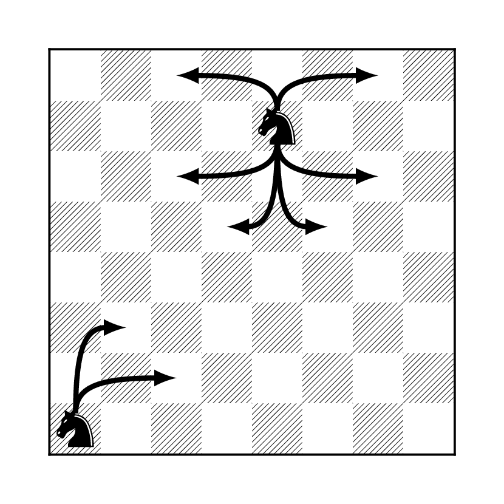

```{r child="mydefs.Rmd"}
```

# Stationary Distributions
<div style="counter-reset: thechapter 8;"> </div>


Transitions between different states of a Markov chain describe
*short-time* behavior of the chain. In most models used in physical and
social sciences, systems change states many times per second. In a rare
few, the time scale of the steps can be measured in hours or days. What
is of interest, however, is the long-term behavior of the system,
measured in thousands, millions, or even billions of steps. Here is an
example: for a typical liquid stock traded on the New York Stock
Exchange, there is a trade every few seconds (or, even, milliseconds),
and each trade changes the price (state) of the stock a little bit. What
is of interest to an investor is, however, the distribution of the
stock-price in 6 months, in a year or, in 30 years - just in time for
retirement. A back-of-an-envelope calculation shows that there are,
approximately, 50 million trades in 30 years. So, a grasp of very-long
time behavior of a Markov chain is one of the most important achievments
of probability in general, and stochastic-process theory in particular.
We only scratch the surface in this lecture.

## Stationarity and stationary distributions

**Definition.** A stochastic process $\seqz{X}$ is said to be **stationary** 
if the random vectors
$$(X_0,X_{1},X_{2},\dots, X_{k})\text{ and }
(X_m,X_{m+1},X_{m+2},\dots, X_{m+k})$$ have the same (joint)
distribution for all $m,k\in\N_0$.

For stationary processes, all random variables $X_0, X_1, \dots$ have
the same distribution (just take $k=0$ in the definition). That
condition is, however, only necessary. The pairs $(X_0,X_1)$ and
$(X_m,X_{m+1})$ should be equally distributed as random vectors, the
same for triplets, etc. Intuitively, a stochastic process is stationary
if, statistically speaking, it does not evolve. Its probabilistic
behavior today is the same as its probabilistic behavior in a billion
years. It is somethings useful to think about stationarity in the
following way; if a system is let to evolve for a long time, it will
reach an equilibrium state and fluctuate around it forever. We can
expect that such a system will look similar a million years from now and
a billion years from now. It might, however, not resemble its present
state at all. Think about a glass of water in which we drop a tiny drop
of ink. Immediately after that, the glass will be clear, with a tiny
black speck. The ink starts to diffuse and the speck starts to grow
immediately. It won't be long before the whole glass is of uniform black
color - the ink has permeated every last "corner" of the glass. After
that, nothing much happens. The ink will never spontaneously return to
its initial state^[It might, actually, but it will take an 
unimaginably long time.].

Ink is composed of many small particles which do
not interact with each other too much. They do, however, get bombarded
by the molecules of water, and this bombardment makes them behave like
random walks^[This phenomenon is called **diffusion**.] which simply bounce back once they hit the glass wall.
Each ink particle will wander off in its own direction, and quite soon,
they will be "everywhere". Eventually, the distribution of the ink in
the glass becomes very close to uniform and no amount of further
activity will change that - you just cannot get more "random" then the
uniform distribution in a glass of water.

Let us get back to mathematics and give two simple examples; one of a
process which is not stationary, and the other of a typical stationary
process.

**Example.**
  

1.  The simple random walk is not stationary. Indeed, $X_0$ is a
    constant, while $X_1$ takes two values with equal probabilities, so
    they cannot have the same distribution. Indeed, the distribution of
    $X_n$ is more and more "spread-out" as time passes. Think of an ink
    drop in an infinite ocean. The dark, ink-saturated, region will get
    larger and larger, but it will never stabilize as there is always
    more ocean to invade.

2.  For an example of a stationary process, take a regime switching
    chain $\seqz{X}$ with $p_{01}=p_{10}=1$, and the initial
    distribution $\PP[X_0=0]=\PP[X_0=1]=\tot$. Then $X_n=X_0$ if $n$ is
    even, and $X_n=1-X_0$ if $n$ is odd. Moreover, $X_0$ and $1-X_0$
    have the same distribution (Bernoulli with $p=\tot$), and, so
    $X_0, X_1,\dots$ all have the same distribution. How about
    $k$-tuples? Why do $(X_0,X_1,
    \dots, X_k)$ and $(X_m,X_{m+1},\dots, X_{m+k})$ have the same
    distribution? For $i_0,i_1,\dots, i_k\in \set{0,1}$, by the Markov
    property, we have $$\label{equ:380C}
     \begin{split}
        \PP[ X_0=i_0, X_1=i_i, \dots, X_{k}=i_k]
        &=
        \PP[X_0= i_0] p_{i_0 i_1} p_{i_1 i_2}\dots p_{i_{k-1}  i_{k}}\\ 
        &= \tot p_{i_0 i_1} p_{i_1 i_2}\dots p_{i_{k-1}  i_{k}}.
     \end{split}$$ In the same manner, $$\label{equ:2D2C}
     \begin{split}
        \PP[ X_m=i_0, X_1=i_i, \dots, X_{m+k}=i_k]&=
       \PP[X_m= i_0] p_{i_0 
         i_1} p_{i_1 i_2}\dots p_{i_{k-1}  i_{k}}\\ &=
       \tot p_{i_0 
         i_1} p_{i_1 i_2}\dots p_{i_{k-1}  i_{k}},
     \end{split}$$ so the two distributions are identical.


The second example above is quite instructive. We took a Markov chain
and gave it an initial distribution with the property that $X_0$ and
$X_m$ have the same distribution for all $m\in\N_0$. Magically, the
whole process became stationary. This is not a coincidence; we can play
the same trick with any Markov chain, as long as the initial
distribution with the above property can be found. Actually, such a
distribution is so important that it even has a name:

A distribution $\pi=(\pi_i)_{i\in  S}$ on the state space $S$ of a
Markov chain with transition matrix $P$ is called a **stationary distribution**
if
$$\PP[X_1=i]=\pi_i \text{ for all } i\in S, 
\text{ whenever }
\PP[X_0=i]=\pi_i,\text{ for all } i\in S.$$

In words, $\pi$ is called a stationary distribution if the distribution
of $X_1$ is equal to that of $X_0$ when the distribution of $X_0$ is
$\pi$. Here is a hands-on characterization:

**Proposition.** A nonnegative
vector $\pi=(\pi_i,i\in S)$ with $\sum_{i\in S} \pi_i=1$ is a stationary
distribution if and only if $$\pi P=\pi,$$ when $\pi$ is interpreted as
a row vector. In that case the Markov chain with initial distribution
$\pi$ and transition matrix $P$ is stationary and the distribution of
$X_m$ is $\pi$ for all $m\in\N_0$.

Suppose, first, that $\pi$ is a stationary distribution, and let
$\seqz{X}$ be a Markov chain with initial distribution $\aaz=\pi$ and
transition matrix $P$. Then, $$\aaa{1}=\aaz P=\pi P.$$ By the
assumption, the distribution $\aaa{1}$ of $X_1$ is $\pi$. Therefore,
$\pi= \pi P$.

Conversely, suppose that $\pi=\pi P$. Let $\seqz{X}$ be a Markov chain
with initial distribution $\pi$ and transition matrix $P$. We need to
show that $\seqz{X}$ is stationary. In order to do that, we first note
that all random variables $X_m$, $m\in\N_0$, have the same distribution.
Indeed, the distribution $\aaa{m}$ of $X_m$ is given by
$$\aaa{m}= \aaa{0} P^m= \pi P^m = (\pi P) P^{m-1}= \pi
P^{m-1}=\dots=\pi.$$ Next, we pick $m,k\in\N_0$ and a $k+1$-tuple
$i_0, i_1, \dots, i_k$ of elements of $S$. By the Markov property, we
have $$\label{equ:5716}
 \begin{split}
   \PP[ X_m=i_0, X_{m+1}=i_1,\dots, X_{m+k}=i_{k}]&=
   \PP[X_m=i_0] p_{i_0  i_1} p_{i_1 i_2} \dots p_{i_{k-1} i_{k}}\\ &=
   \pi_{i_0}  p_{i_0  i_1} p_{i_1 i_2} \dots p_{i_{k-1} i_{k}}.
 \end{split}$$ This last expression does not depend on $m$, so we can
conclude that $\seqz{X}$ is stationary.

<div class="problem">
A model of social mobility of families posits three different social
classes (strata), namely "lower", "middle", and "upper". The transitions
between these classes (states) for a given family are governed by the
following transition matrix:
$$P = \pmat{ 1/2 & 1/2 & 0 \\ 1/3 & 1/3 & 1/3 \\ 0 & 1/3 & 2/3 }.$$ 
Find all stationary distributions of this chain.
</div>
<div class="solution">
To compute $\pi$, we start by writing down the following system of
three linear equations: $$\begin{array}{rcrcrcr}
    \pi_1 &=& \frac{1}{2}\, \pi_1    & +& \frac{1}{3}\, \pi_2        && \\
    \pi_2 &=& \frac{1}{2}\, \pi_1  & +& \frac{1}{3}\, \pi_2  &+&
    \frac{1}{2}\, \pi_3 \\
    \pi_3 &=&              &&   \frac{1}{3}\, \pi_2  &+&
    \frac{2}{3}\, \pi_3 
\end{array}$$ 
We solve the system and obtain that any triplet
$(\pi_1,\pi_2,\pi_3)$ with $$\label{equ:in-pi2}
 \pi_1 = \tf{2}{3} \pi_2 \eand \pi_3 = \pi_2$$ is a solution. Of course,
$\pi$ needs to be a probability distribution, so we also need to require
that $\pi_1+\pi_2+\pi_3 = 1$. We plug in the expressions
for $\pi_1$ and $\pi_3$ in terms of $\pi_2$ obtained above into
it to conclude that $\pi_2 = 3/8$. From there, the unique stationary
distribution is given by $$\pi = ( \tf{2}{8}, \tf{3}{8}, \tf{3}{8} ).$$
</div>

Let us get
back to the story about the glass of water and let us analyze a
simplified model of that phenomenon. Our glass will be represented by
the set $\set{0,1,2,\dots, a}$, where $0$ and $a$ are the positions
adjacent to the walls of the glass. The ink particle performs a version
simple random walk inside the glass - it moves to the left, to the right
or stays put with equal probabilities, namely $\tf{1}{3}$. Once it
reaches the state $0$ further passage to the left is blocked by the
wall, so it either takes a step to the right to position $1$ (with
probability $\tf{1}{3}$) or stays put (with probability $\tf{2}{3}$).
The same thing happens at the other wall. All in all, we get a Markov
chain with the following transition matrix $$P=
\begin{bmatrix}
  \tf{2}{3} & \tf{1}{3} & 0 & 0 & \dots & 0 & 0 & 0 \\
\tf{1}{3} & \tf{1}{3} & \tf{1}{3} & 0 & \dots & 0 & 0 & 0 \\
0 & \tf{1}{3} & \tf{1}{3} & \tf{1}{3} & \dots & 0 & 0 & 0 \\
\vdots & \vdots & \vdots &\vdots  & \ddots & \vdots & \vdots & \vdots \\
0 & 0 & 0 & 0 & \dots & \tf{1}{3} & \tf{1}{3} & 0 \\
0 & 0 & 0 & 0 & \dots & \tf{1}{3} & \tf{1}{3} & \tf{1}{3} \\
0 & 0 & 0 & 0 & \dots & 0 & \tf{1}{3} & \tf{2}{3} \\
\end{bmatrix}.$$ Let us see what happens when we start the chain with a
distribution concentrated at $a/2$; a graphical representation
(histogram) of the distributions of $X_0$, $X_{1}$, $X_{3}$, $X_{25}$,
$X_{100}$ and $X_{500}$ when $a=10$ represents the behavior of the
system very well :

```{r echo=F, fig.align="center", out.width="80%"}
N=11
P = matrix(0, ncol = N, nrow=N)
for (i in 2:(N-1)) {
  P[i,i-1] = 1/3; P[i,i] = 1/3; P[i,i+1] = 1/3
}
P[1,1] = 2/3; P[1,2] = 1/3
P[N,N] = 2/3; P[N,N-1] = 1/3

# initial condition
a0 = matrix(0, nrow=1, ncol=N)
a0[1,6]=1

one_plot = function(n) {
  a = a0
  if (n > 0) {
    for (i in 1:n) a = a %*% P
  }
  df = data.frame(x=10*as.vector(a))
  p = ggplot(data=df, aes(x=1:N, y=x))+geom_col( fill="darkblue")+coord_fixed()+theme_void()+
    ggtitle(paste("n =",n))+theme(plot.title = element_text(hjust = 0.5))
  if (n > 3) {
    p = p + ylim(0,2)
  } else {
    p = p + ylim(0,10)
  }
  return(p)
}

ns = c(0,1,3,25,100,500)
ps = lapply(ns, one_plot)
gridExtra::grid.arrange(grobs=ps, nrow=2)

```


How about if we start from a different initial distribution? Here are
the same plots when the initial distribution is concentrated at $0$:

```{r echo=F, out.width="80%", fig.align="center"}
# another initial condition
a0 = matrix(0, nrow=1, ncol=N)
a0[1,1]=1
ns = c(0,1,3,25,100,500)
ps = lapply(ns, one_plot)
gridExtra::grid.arrange(grobs=ps, nrow=2)
```


As you can see, the distribution changes rapidly at first, but then,
once it has reached the "equilibrium" it changes remarkably little
(compare $X_{100}$ and $X_{500}$; when $X_0=a/2$, even $X_{25}$ is not
very far). Also, the "equilibrium" distribution seems to be uniform and
*does not depend on the initial distribution*; this is exactly what you
would expect from a long-term distribution of ink in a glass.

\medskip

Let us show that the uniform distribution $$\pi=\Big(\frac{1}{a+1}, \frac{1}{a+1},
\dots, \frac{1}{a+1}\Big)$$ is indeed the stationary distribution. For that 
we need to show that it solves the system
$\pi=P\pi$, which, expanded, looks like this $$\begin{split}
     \pi_0 & = \tf{2}{3} \pi_0+ \tf{1}{3} \pi_1 \\
     \pi_1 & = \tf{1}{3} (\pi_0 + \pi_1 + \pi_2) \\
     \pi_2 & = \tf{1}{3} (\pi_1 + \pi_2 + \pi_3) \\
& \hspace{0.5em} \vdots \\
     \pi_{a-1} & = \tf{1}{3} (\pi_{a-2}+\pi_{a-1} + \pi_{a}) \\
     \pi_{a} & = \tf{1}{3} \pi_{a-1}+ \tf{2}{3} \pi_{a}
   \end{split}$$ It is immediate that
$\pi_0 = \pi_1 = \dots = \pi_a = \oo{a+1}$ is a probability distribution
that solves the system above. On the other hand, the first equation
yields $\pi_1 = \pi_0$, the second one that $\pi_2 = 2
\pi_1 - \pi_0 = \pi_0$, the third $\pi_3 = 2 \pi_2 - \pi_1 = \pi_0$,
etc. Therefore all $\pi_i$ must be the same, and, since
$\sum_{i=0}^a \pi_i =
1$, we conclude that the uniform distribution is the only stationary
distribution.

Can there be more than one stationary distribution? Can there be none?
Sure, here is an example:

**Example.**

1.  For $P=I$, any distribution is stationary, so there are are
    infinitely many stationary distributions.

2.  A simple example where no stationary distribution exists can be
    constructed on an infinite state space (but not on a finite space,
    as we will soon see). Take the Deterministically Monotone Markov
    chain. The transition "matrix" looks like the identity matrix, with
    the diagonal of ones shifted to the right. Therefore, the system of
    equations $\pi=\pi P$ reads $$\pi_1= \pi_2, \pi_2=\pi_3, \dots,
    \pi_n=\pi_{n+1}, \dots,$$ and so, for $\pi$ to be a stationary
    distribution, we must have $\pi_n=\pi_1$ for all $n\in\N$. Now, if
    $\pi_1=0$, $\pi$ is not a distribution (it sums to $0$, not $1$).
    But if $\pi_1>0$, then the sum is $+\infty$, so $\pi$ is not a
    distribution either. Intuitively, the chain never stabilizes, it
    just keeps moving to the right ad infinitum.

The example with many stationary distributions can be constructed on any
state space, but the other one, where no stationary distribution exists,
had to use an infinite one. Was that necessary? Yes. Before we show this
fact, let us analyze the relation between stationary distributions and
the properties of recurrence and transience. Here is our first result:

**Proposition.** 
Suppose that the state space $S$ of a Markov chain is finite and let
$S=C_1\cup C_2\cup \dots \cup C_m \cup
  T$ be its canonical decomposition into recurrent classes $C_1, \dots,
  C_m$ and the set of transient states $T$. Then the following two
statements are equivalent:

1.  $\pi$ is a stationary distribution, and

2.  $\pi_{C_k}= \pi_{C_k} P_k$, $k=1,\dots, m$, and
    $\pi_T=(0,0,\dots, 0)$,

where $$P=
\begin{bmatrix}
P_1      & 0      & 0        & 0   \\
\vdots   & \ddots & \vdots   & 0   \\
0        & 0      & P_m      & 0  \\
 & R &  & Q 
\end{bmatrix},$$ is the canonical form of the transition matrix,
$\pi_{C_k}=(\pi_i, i\in C_k)$, $k=1,2,\dots, m$ and
$\pi_T=(\pi_i, i\in T)$.

**Proof.**
We write the equation $\pi=\pi P$ coordinatewise as
$\pi_j=\sum_{i\in  S} \pi_i p_{ij}$ and, by distinguishing the cases
$i\in C_k$, $k\in\set{1,2,\dots, m}$, and $i\in T$, we get the following
sytem of matrix equations (alternatively, just write the system
$\pi= \pi P$ in the block-matrix form according to the cannonical
decomposition above): $$\pi_{C_k} = \pi_{C_K} P_{C_k} + \pi_T R,\ 
k=1,\dots, m,  \text{ and } \pi_T =
\pi_T Q.$$ The last equality can be read as follows: $\pi_T$ is in a row
null-space of $I-Q$. We know, however, that $I-Q$ admits an inverse, and
so it is a regular square matrix. Its row null-space (as well as its
column null-space) must be trivial, and, consequently, $\pi_T=0$.

Having established that $\pi_T=0$, we can de-couple the system of
equations above and write it as $$\pi_{C_k} = \pi_{C_K} P_{k},\ 
k=1,\dots, m,  \text{ and } \pi_T = (0,0,\dots, 0),$$ which is exactly
what we needed to prove.

The other implication - the proof of which consists of a verification of
the fact that each distribution from *(2)* above is indeed a stationary
distribution - is left to the reader. QED

The moral of the story of the Proposition above
is the following: in order to compute
the stationary distribution(s), classify the states and find the
canonical decomposition of the state space. Then, set $\pi_i=0$ for any
transient state $i$. What remains are recurrent classes, and you can
analyize each one separately. Note, however, that $\pi_{C_k}$ does not
need to be a real distribution on $C_k$, since
$\sum_{i\in C_k} (\pi_{C_k})_i$ does not need to equal $1$. However,
unless $\pi_{C_k}=(0,0,\dots,
0)$, we can always multiply all its elements by a constant to make the
sum equal to $1$.

## Stationary distributions for finite irreducible chains and Kac's lemma

We now know what the general structure of the set of all stationary
distributions is, but we still have no clue as to whether they actually
exist. Indeed, our results so far had the following form: "If $\pi$ is a
stationary distribution, then ...". Luckily, these results also allow us
to focus our search on single recurrent classes, or, more comfortably,
chains consisting of a single recurrent class. They are important enough
to get a name:

**Definition.** A Markov chain is said to be **irreducible** if it has only one class.

We also assume from now on that the state space is finite. That rules
out, in particular, our non-existence example above 
which required an infinite chain. We will see
that that is not a coincidence, and that the situation is much cleaner
in the finite setting. In fact, our next result (known as Kac's lemma,
but we state it here as a theorem) gives a very nice answer to the
question of existence and uniqueness, with an unexpected benefit:

**Theorem (Kac's theorem)** Let $\seqz{X}$ be an irreducible
Markov chain with a finite state space. Then

1.  there exists a unique stationary distribution $\pi = (\pi_j)_{j\in S}$,

2.  moreover, it is given by the following formula:
    $$\pi_j= \frac{\nu_{ij}}{m_i} ,\  j\in S,$$ where $i$ is an
    arbitrary but fixed state, and
    $$\nu_{i j}=\EE_i\left[ \sum_{n=0}^{T_i(1)-1} \inds{X_n=j}\right]
      \eand m_i = \EE_i[ T_i(1)]<\infty$$ are the expected number of
    visits to state $j$ in between two consecutive visits to state $i$,
    and the expected return time to $i$, respectively.

Even
though it is not exceedingly hard, the proof of this proposition is a
bit technical, so we omit it. It is important, however, to understand
what the result states:

1.  The stationary distribution $\pi$ exists and is unique in any
    irreducible finite Markov chain. Moreover, $\pi_i>0$ for all
    $i\in S$.

2.  The expected number of visits to the state $j$ in between two
    consecutive visits to the state $i$ can be related to a stationary
    distribution by $\nu_{ij}= m_i \pi_j$. By uniqueness, the quotient
    $\tf{\nu_{ij}}{m_i}$ does not depend on the state $i$.

3.  When we set $j=i$, $\nu_{ii}$ counts the number of visits to $i$
    between two consecutive visits to $i$, which is always equal to $1$
    (the first visit is counted and the last one is not). Therefore,
    $\nu_{ii}=1$, and so $\pi_i=\frac{1}{m_i}$ and
    $\nu_{ij} = \pi_j/\pi_i$.

All of this is typically used in the following way:
one first computes the unique stationary distribution $\pi$ by solving
the equation $\pi=\pi P$ and then uses it to determine $m_i$ or the
$\nu_{ij}$'s. Here is a simple problem:

<div class="problem">
 Suppose that traffic
statistics on a given road are as follows: on average, three out of every four
trucks are followed by a car, but only one out of every five cars is
followed by a truck. A truck passes by you. How many cars do you expect
to see before another truck passes?
</div>

<div class="solution">
The type of the vehicle passing by you (car or truck) can be modeled by
a Markov chain with two states and the transition matrix:
$$P = \pmat{ \frac{4}{5} & \frac{1}{5} \\ \frac{3}{4} &
\frac{1}{4} },$$ with the first row (column) corresponding to the
state "car". We are interested in the number of "visits" to the state
"car" ($j=1$) between two visits to the state "truck" ($i=2$), which we
denoted by $\nu_{21}$ in Kac's theorem.
According to the same theorem, it is a good idea to find the (unique)
stationary distribution first. The equations are $$\begin{aligned}
  \pi_1 &= \tf{4}{5} \pi_1 + \tf{3}{4} \pi_2\\
  \pi_2 &= \tf{1}{5} \pi_1 + \tf{1}{4} \pi_2,\end{aligned}$$ which, with
the additional requirement $\pi_1+\pi_2 = 1$, give
$$\pi_1 = \tfrac{15}{19}, \pi_2 = \tfrac{4}{19}.$$ Since
$v_{ij} = m_i \pi_j$, we have $v_{21} = m_2 \pi_1 = \tfrac{15}{19}
m_2$. We also know that $m_2 = 1/\pi_2 = \tf{19}{4}$, and, so, we expect
to see $\tf{15}{4}  = 3.75$ cars between two consecutive trucks.

\medskip

In this particular case, we could have answered the question by
computing the expected return time $m_2 = \EE_2[ T_2(1)]$ to the state
$2$. As above, $m_2 = 1/\pi_2 = \tfrac{19}{4}$. We have to be careful,
because the state $2$ itself is counted exactly once in this
expectation, so $m_2 =
\tfrac{19}{4}$ does not only count all the cars between two trucks, but
also one of the trucks. Therefore, the number of cars only is
$\tf{19}{4} -
1 = \tf{15}{4}$, which is exactly the number we obtained above.
</div>

The family of Markov chains called **random walks on graphs** provides for
many interesting and
unexpected applications of Kac's theorem. We
start by remembering what a (simple) graph is.

**Definition.** A **simple graph** is defined by a finite set $V$ 
(whose elements are called **vertices** or **nodes**) and a set
$E$ if unordered pairs of distinct vertices (whose elements are called
**edges**).

Intuitively, a simple graph is a finite collection of points, some of
which are connected by lines. We do not allow loops (edges from a vertex
to itself) or multiple edged between vertices. For two vertices $i$ and
$j$ write $i \sim j$ if there is an edge between $i$ and $j$, and say
that $i$ and $j$ are **neighbors** . The number of neighbors of the vertex $i$ called
the **degree** of  $i$, and is denoted by $d(i)$.

\medskip
Given a simple graph $G$, let the **random walk on $G$** be the Markov chain defined as
follows:

1.  The set of states $S$ is the set of vertices $V$ of the graph $G$.

2.  To move from a state (vertex) to the next one, chose one of its
    neighbors, uniformly at random, and jump to it. More precisely,
    $$p_{ij} = \begin{cases} 0 & i \not \sim j \\ 
              1/d(i) & i \sim j.  \end{cases}$$

As long as the underlying graph is connected (you can move from any
state to any other state by traveling on edges only), the corresponding
random walk is irreducible and each state is recurrent. The interesting
thing is that there is a very simple expression for the (unique)
stationary distribution. Indeed, if we write our usual system of
equations $\pi = \pi P$ that defines $\pi$ in this case, we obtain
$$\pi_j = \sum_i \pi_i p_{ij} =  \sum_{i: i\sim j} \pi_i \oo{d(i)}.$$ If
we plug in $\pi_i = d(i)$ into the right-hand side, we get $d(j)$,
because there are $d(j)$ terms, each of which equals $1$. This matches
the left-hand side, so we have a solution to $\pi = \pi P$. The only
thing missing is that these $\pi$s do not add up to $1$. That is easily
fixed by dividing by their sum, and we obtain the following nice
expression for the stationary distribution:
$$\pi_i = \frac{d(i)}{ \sum_{j\in V} d(j) }.$$

**Example.** A interesting example
of a random walk on a graph can be constructed on a chessboard. We pick
a piece, say knight, and make it choose, uniformly, from the set of all
legal moves. This corresponds to a graph whose vertices are the squares
the board, with the two vertices connected by an edge if and only if it
is legal for a knight to go from one of them to the other in a single
move. 

```{r echo=FALSE, fig.align="center", out.width="40%"}

```

What makes all of this possible is the fact that the rules
governing the knight's moves are symmetric. If it can jump from $i$ to
$j$, then it can also jump from $j$ to $i$. We would not be able to
construct a random walk on a graph based on the moves of a pawn, for
example.

\medskip
Once we have built the chain, we can check that it is irreducible (do
it!), and compute its stationary distribution by computing degrees of
all vertices. They are given by the number of different legal moves from
each of the 64 squares, as in the following picture 


```{r echo=FALSE, fig.align="center", out.width="40%"}
knitr::include_graphics('pics/knight_numbers.png')
```


The value assigned
to each square by stationary distribution is then simply the number on
that square, divided by the sum of all the numbers on the board, which
happens to be $336$.

Kac's theorem can now be used to answer the following, classical
question:

<div class="problem">
A knight starts from the lower left corner of a chessboard, and moves
around by selecting one of its legal moves at random at each step, and
taking it. What is expected number of moves it will take before it
returns to the lower left corner?
</div>
<div class="solution">The question is asking for the value of 
$m_i = \EE_i[ T_i(1)]$ where
$i$ is the "lower left corner". By Kac's theorem this
equals to $1/\pi_i = 336/2 = 168$. If the knight started from one of the
central squares, this time would be $4$ times shorter ($42$). It is also
easy to compute the expected number of visits to another state, between
two visits to the lower left corner. The answer is simply the degree of that
state divided by $2$ (the degree of the lower left corner).
</div>

## Long-run averages

One of the most important properties of stationary distributions is that
they describe the long-term behavior of a Markov chain. Before we
explain how, let us recall the classical Law of Large Numbers (LLN) for
independent variables:

**Theorem (Law of Large Numbers).** Let $\seqz{Y}$ be a sequence of
independent and identically distributed random variables, such that
$\EE[\abs{Y_0}]<\infty$. Then
$$\lim_n \frac{1}{n} \sum\limits_{k=0}^{n-1} Y_k = \EE[Y_0],$$ (in an
appropriate, mathematically precise, sense).

A special case goes by the name Borel's Law of Large Numbers and applies
to the case where each $Y_n$ is a Bernoulli random variable, i.e., takes
only the values $0$ and $1$ (like tossing a biased coin repeatedly). In
this case, we have $\sum_{k=0}^{n-1} Y_k = N_n$, where $N_n$ is the
number of "successes" (time instances $k$ when $Y_k=1$) up to time $n$.
The quotient $\oo{n} N_n$ is then the proportion of "successes" among
the first $n$ experiments, and Borel's law states that it converges
towards the "theoretical frequency", i.e., the probability 
$p =\PP[Y_0=1]$ of a single "success". Put differently, $p$ is the long-run
proportion of the times $k$ when $Y_k=1$.

\medskip

If we try to do the same with a Markov chain, we run into two problems.
First, the random variables $X_0,X_1,\dots$ are neither independent nor
identically distributed. Second, $X_k$ takes its values in the state
space $S$ which does not necessarily consist of numbers, so the
expression $X_0+X_1$ or $\EE[X_0]$ does not make sense for every Markov
chain. To deal with the second problem, we pick a numerical "reward"
function $f: S\to \R$ and form sums of the form
$f(X_0)+f(X_1)+\dots+f(X_{n-1})$. Independence is much more subtle, but
the Markov property and irreducibility of the chain can be used as a
replacement:

**Theorem (Ergodic Theorem for Markov Chains).** Let $\seqz{X}$
be a finite and irreducible Markov chain. For any function $f: S\to \R$
we have
$$\lim_n \oo{n} \sum_{k=0}^{n-1} f(X_k) = \EE_{\pi}[f(X_0)]:=\sum_{j\in S}
f(j)\pi_j,$$ where $\pi$ is the (unique) stationary distribution of $X$.

An important special case - corresponding conceptually to Borel's law -
is when the function $f$ equals $0$ except for one state, where it
equals $1$. In more compact notation, we pick a state $i_0$ and define
the function $f$ by the following formula
$$f(i) = \begin{cases} 1 & i = i_0 \\ 0 & i \ne i_0. \end{cases}$$ If we
apply the Ergodic theorem with that particular $f$, we immediately get
the following nice result:

**Proposition.** Given a finite
and irreducible Markov chain, let $N^i_n$ denote the number of visits to
the state $i$ in the first $n$ steps. Then,
$$\pi_i = \lim_n \oo{n} N^i_n,$$ where $\pi$ is the chain's (unique)
stationary distribution.

Put another way,

> *In a finite irreducible Markov chain, the component $\pi_i$ of the
> stationary distribution $\pi$ can be interpreted as the portion
> (percentage) of time the chain spends in the state $i$, over a long
> run.*

## Limiting distributions


When we discussed the example of ink diffusing in a glass, we noticed 
how the distribution of ink
quickly reaches the uniform equilibrium state. It is no coincidence that
this "limiting" distribution happens to be a stationary distribution.
Before we make this claim more precise, let us define rigorously what we
mean by a limiting distribution:

**Definition.** A distribution $\pi=(\pi_i, i\in  S)$
on the state space $S$ of a Markov chain with transition matrix $P$ is
called a **limiting distribution** 
if $$\lim_{n\to\infty} \pn_{ij}=\pi_j,$$ for all $i,j\in S$.

1.  Note that for $\pi$ to be a limiting distribution, all the limits in the
    Definition above must exist. Once they do (and
    $S$ is finite), $\pi$ is automatically a probability distribution:
    $\pi_j\geq 0$ (as a limit of non-negative numbers) and
    $$\sum_{j\in S} \pi_j =
    \sum_{j\in S} \lim_{n\to\infty} \pn_{ij} =
    \lim_{n\to\infty} \sum_{j\in S} \pn_{ij} =\lim_{n\to\infty} 1 = 1.$$
    In a Deterministically Monotone Markov Chain we have $\pn_{ij}=0$
    for $n> j-i$. Therefore $\pi_j:=\lim_{n\to\infty} \pn_{ij} = 0$ for
    each $i$, but these $\pi$s do not define a probability distribution
    because they do not add up to $1$.

2.  Note that the independence on the initial state $i$ is built into
    the definition of the limiting distribution: the sequence
    $\{\pn_{ij}\}_{n\in\N}$ must tend to the same limit $\pi_j$ for all
    $i\in  S$.

3.  Since limits are unique, there can be at most one limiting
    distribution in a given chain.

The connection with stationary distributions is spelled out in the
following propositions:

**Proposition.** Suppose that a Markov chain with
transition matrix $P$ admits a limiting distribution
$\pi=(\pi_i,i\in S)$. Then $\pi$ is a stationary distribution.

**Proof.** To show that $\pi$ is a stationary distribution, we need to verify that
it satisfies $\pi=\pi P$, i.e., that
$$\pi_{j}= \sum_{i\in S} \pi_i p_{ij}.$$ We use the Chapman-Kolmogorov
equation $\pnp{n+1}_{ij}=
\sum_{k\in S} \pn_{ik} p_{kj}$ and start from the observation that
$\pi_j=\lim_{n\to\infty} \pnp{n+1}_{ij}$ to get exactly what we need:
$$\pi_j=\lim_{n\to\infty} \pnp{n+1}_{ij}= \lim_{n\to\infty} 
\sum_{k\in S} \pn_{ik} p_{kj} =
\sum_{k\in S} (\lim_{n\to\infty} \pn_{ik}) p_{kj} =
\sum_{k\in S} \pi_k p_{kj}. \text{ QED}$$

Limiting distributions don't need to exist, even when there are
stationary ones. Here are two examples:

1.  Let $\seqz{X}$ be an extreme regime-switching chain which alternates
    deterministically between states $0$ and $1$. Its transition matrix
    is given by $$P=
      \pmat{0 & 1 \\ 1 & 0}$$ and it is easy to see that
    $$P^{2n-1} = \pmat{0 & 1 \\ 1 & 0} \eand
    P^{2n} = \pmat{1 & 0 \\ 0 & 1} \efor n\in\N.$$ That means that the
    values of each $\pn_{ij}$ oscillate between $0$ and $1$, and,
    therefore, cannot converge to anything when $n\to\infty$. In other
    words, there is no limiting distribution. On the other hand, a
    stationary distribution $\pi = (\tot, \tot)$ clearly exists.

2.  In the previous example the limiting distribution did not exists
    because the limits of the sequences $\pn_{ij}$ did not exist. A more
    subtle reason for the non-existence of limiting distributions can be
    dependence on the initial conditions: the limits $\lim_n \pn_{ij}$
    may exist for all $i,j$, but their values can depend on $i$ (which
    it outlawed in the definition of the limiting distribution above. 
    The simplest example is a
    Markov chain with two states $i=1,2$ which does not move at all,
    i.e., where $p_{11}=p_{22}=1$. It follows that for each $n$, we have
    $\pn_{ij} = 1$ if $i=j$ and $\pn_{ij}=0$ if $i\ne j$. Therefore, the
    limits $\lim_{n\to\infty}
      \pn_{ij}$ exist for each pair $i,j$, but their values depend on
    the initial state $i$: $$\lim_{n\to\infty} \pn_{12} = 0 \eand 
      \lim_{n\to\infty} \pn_{22} = 1.$$

The first part of the example above shows that no limiting distribution
needs to exist even in the simplest of irreducible finite chains.
Luckily, it also identifies the problem: the chain is periodic and it
looks very differently on even vs. odd time points. Clearly, when the
chain exhibits this kind of a periodic behavior, it will always be
possible to separate even from odd points in time, and, therefore, no
equilibrium can be achieved. For this reason, we need to assume,
additionally, that the chain is aperiodic. The beauty of the following
result (which we give without a proof) is that nothing else is needed.

**Theorem. (Convergence theorem)** Let $\seqz{X}$ be
a finite-state, irreducible and aperiodic Markov chain. Then the
limiting distribution exists.

**Example.**
When we first introuced Markov chains and their transition probabilities 
we considered a two-state "Regime-switching"
Markov chain with the following transition matrix:
$$P =  \pmat{1-a & a \\ b & 1-b},$$ where $0<a,b<1$. Using
diagonalization, we produced the following expression for $P^n$:
$$P^n = 
  \pmat{
  \frac{b}{a+b}+(1-a-b)^n \frac{a}{a+b} &   \frac{a}{a+b}-(1-a-b)^n \frac{a}{a+b}\\
  \frac{b}{a+b}+(1-a-b)^n \frac{b}{a+b} &   \frac{a}{a+b}-(1-a-b)^n \frac{b}{a+b}
}.$$ Since $\abs{1-a-b}<1$, we have $(1-a-b)^n \to 0$ as $n\to\infty$,
and, so
$$\lim_n P^n = \pmat{ \tf{b}{a+b} & \tf{a}{a+b} \\ \tf{b}{a+b} & \tf{a}{a+b}}$$
It follows that $(\tf{b}{a+b}, \tf{a}{a+b})$ is a limiting distribution.
Of course, we could have concluded that directly from the Convergence theorem above, 
Theorem, since our chain is clearly finite, irreducible and aperiodic.

## The PageRank algorithm

An internet user searches for the term "Jimi Hendrix" and find out that
it appears in more than 60 million web pages. Some of these pages are
likely to be more important than others. For example, the Wikipedia
entry for the famous guitarist is almost certainly more relevant for an
average user than the web page my son built for his gerbil Jimi Hendrix.
After the difficult task of actually identifying the 60 million pages
has been accomplished (how to do that is a problem we do not go into in
these notes), the search engine must decide which 10 or so pages to show
to the user first. In other words, it must rank the 60 million pages in
some order of relevance, and then return 10 top-ranked pages. The
*PageRank* algorithm^[what we describe here is a simplification of the true PageRank
    algorithm.] of Sergey Brin and Larry Page addressed that
exact question. It proposes a notion of "relevance" for each web page,
called , which reflects its relative importance among all web pages on
the internet (there are billions of them - see [here](https://www.worldwidewebsize.com) for the latest numbers).

The main idea is that links to a page make the page more relevant. But
also, links from more relevant pages should count more than links from
obscure ones. Very soon, this kind of logic becomes circular, because it
appears that you need have a notion of relevance to define the notion of
relevance. It is the powerful notion of a stationary distribution that
comes to rescue.

In their original 1998 paper *The Anatomy of a Large-Scale Hypertextual
Web Search Engine*, Brin and Page envision a "random surfer". This
hypothetical internet user starts from a given web page and navigates
the web in the following way: he/she makes a list of all links from the
web page he/she is currently one, picks a random link from that list
(all links have equal probabilities of being picked) and follows it.
Repeating this process over and over, our server follows a Markov Chain
on the state space $S$, where $S$ is the set of all  web
pages on the internet. Even if the starting page is my son's gerbil's
web page, it is intuitively clear that our surfer will soon reach one of
the better known pages (like `facebook.com` or `amazon.com`, or even
`google.com` itself). The idea of Brin and Page was then to think of the
relevance of the page as the long-term proportion of time spent on that
web page by a random surfer. In the theoretical discussion 
above we learned that these long-term
proportions are given by nothing other than the probabilities $\pi_i$
that form the stationary distribution. Moreover, stationary distribution
is also a limiting distribution if we assume that the "Internet Markov
Chain" described above is finite, irreducible and aperiodic, and we can
apply Convergence Theorem. 

The procedure to compute the PageRank would then be similar to the
following:

1.  Collect the information about all states (web pages) and all
    transitions (links) and form a Markov Chain. Give all transitions
    from a given web page equal probabilities.

2.  Compute the stationary distribution $(\pi_i)$

3.  rank the states using the stationary distribution as weights. The
    page with the highest $\pi_i$ gets rank $1$, then one with the
    second highest rank $2$, etc.

Of course, the computation of the stationary distribution for a Markov
Chain with billions of states is not trivial at all. The system to be
solved involved billions of equations and billions of unknowns. One way
to do this numerically is to use Markov-Chain theory again, and compute
a high power of the matrix $P$. Since the limiting distribution exists
and equals the stationary distribution, we expect every row of $P^n$ to
approximate $\pi$ for $n$ large enough.

\smallskip

Let us go back to the fundamental assumption of irreducibility that we
need for the stationary distribution to exist and be unique. The real
"Internet Markov Chain" is almost certainly not irreducible. There are
pages that contain no links, there are collections of pages that only
link to each other. To deal with this problem (and to speed up numerical
computations) Brin and Page decided to modify the transition matrix P in
the way that is best explained by considering the random surfer. In the
new chain, the surfer first tosses a (biased) coin. If the coin comes up
Heads, he/she follows the standard procedure by picking a page linked
from the current page at random and following the link. If the coin
shows Tails, he/she chooses a web page at random (any page on the
internet is chosen with equal probability) and jumps to it. In other
words, if the coin show Tails, the surfer behaves as if the current page
has a link to every other page on the internet.

The probability $d$ of Heads is typically big (the value of $d=0.85$ is
sometimes used) but ensures that every entry of the transition matrix is
at least $1-d=0.15$, and, in particular, positive. This way, the chain
is guaranteed to be irreducible, and our theorems are guaranteed to
apply. The element $p_{ij}$ at the position $(i,j)$ of the modified
transition matrix is given by
$$p_{ij} = \begin{cases} (1-d)\tfrac{1}{N} + d \oo{L_i} & \text{ if $i$ links to $j$,
  and} \\
(1-d)\oo{N}, & \text{ otherwise,}\end{cases}$$ Where $L_i$ is the total
number of links on page $i$ and $N$ is the total number of pages on the
internet. If we write down the definition of the stationary distribution
$\pi$ in this case, we obtain the following formula
$$\pi_j = \sum_i \pi_i p_{ij} = (1-d) \oo{N} +  d \sum_{i,
  p_{ij}>0} \pi_i
\oo{L_i}.$$ In words,

*The "relevance" $\pi_j$ of the page $j$ is the convex combination of
the "base relevance" $\oo{N}$ and the weighted average of the
"relevances" of all the pages $i$ which link to $j$, where the weight of
$i$ is inversely proportional to the total number of links from $i$.*

\medskip

Google uses a much more complex algorithm these days, but the PageRank
remains one of the most important (and most lucrative) applications of
the Markov Chain theory in history.


## Additional Problems for Chapter 8

<div style="border: 1px solid; padding: 5px;">
**Note:** do not use simulations in any of the problems below. Using R (or other software) to manipulate matrices or perform other numerical computation is fine.  
</div>

<br>

<!--
  sl-prob-01
  ------------------------------------------------
-->
<div class="problem">
```{r child="problems/05_Stationary_Distributions/sl-prob-01_prb.Rmd"}
```
</div>
<div class="solution">
```{r child="problems/05_Stationary_Distributions/sl-prob-01_sol.Rmd"}
```
</div>


<!--
  sl-mc-exam-07
  ------------------------------------------------
-->
<div class="problem">
```{r child="problems/05_Stationary_Distributions/sl-mc-exam-07_prb.Rmd"}
```
</div>
<div class="solution">
```{r child="problems/05_Stationary_Distributions/sl-mc-exam-07_sol.Rmd"}
```
</div>

<!--
  mc_prob3
  ------------------------------------------------
-->
<div class="problem">
```{r child="problems/05_Stationary_Distributions/mc_prob3_prb.Rmd"}
```
</div>
<div class="solution">
```{r child="problems/05_Stationary_Distributions/mc_prob3_sol.Rmd"}
```
</div>


<!--
  sl-prob-02
  ------------------------------------------------
-->
<div class="problem">
```{r child="problems/05_Stationary_Distributions/sl-prob-02_prb.Rmd"}
```
</div>
<div class="solution">
```{r child="problems/05_Stationary_Distributions/sl-prob-02_sol.Rmd"}
```
</div>


<!--
  mc_prob1
  ------------------------------------------------
-->
<div class="problem">
```{r child="problems/05_Stationary_Distributions/mc_prob1_prb.Rmd"}
```
</div>
<div class="solution">
```{r child="problems/05_Stationary_Distributions/mc_prob1_sol.Rmd"}
```
</div>


<!--
  friends
  ------------------------------------------------
-->
<div class="problem">
```{r child="problems/05_Stationary_Distributions/friends_prb.Rmd"}
```
</div>
<div class="solution">
```{r child="problems/05_Stationary_Distributions/friends_sol.Rmd"}
```
</div>

<!--
  sl-prob-04
  ------------------------------------------------
-->
<div class="problem">
```{r child="problems/05_Stationary_Distributions/sl-prob-04_prb.Rmd"}
```
</div>
<div class="solution">
```{r child="problems/05_Stationary_Distributions/sl-prob-04_sol.Rmd"}
```
</div>


⬇︎ In case you were wondering, the text below belongs to footnotes from somewhere high above.⬇︎


